本文整理 H&NCTF2026 Reverse 方向 Writeup，包含 Hexgate、PatrolNote、ezvm、mov-add、shell、game 和 entropybox 的分析与解题过程。

<!-- more -->

## Hexgate

首先将附件拖到ide检测发现是go语言写的😣

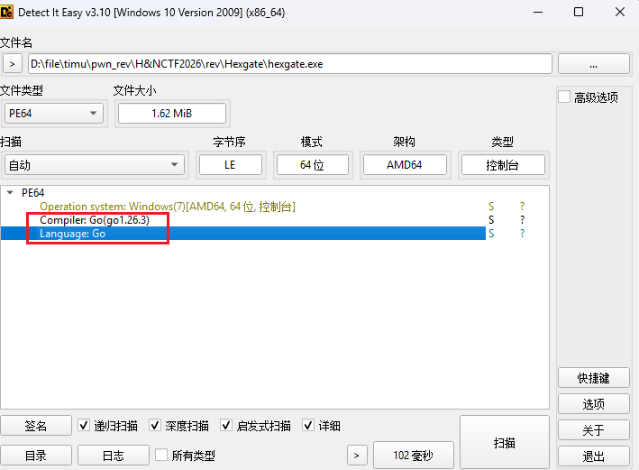

尝试运行发现是输入flag并且比对

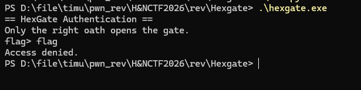

ida打开发现虽然能找到打印menu的函数但是函数名称都没了，分析起来很复杂

GPT老师说：“但 Go 为了运行时栈回溯、崩溃信息、GC 和源码行号映射等功能，二进制中通常会保存一套运行时函数元数据，例如 `pclntab`。其中包含函数表和函数名表；Go 官方的 `debug/gosym` 也能从这些数据中获得函数列表、函数名称和 PC 对应的源码行号。”

因此是可以进行恢复的，以下是跟着GPT老师恢复后总结的流程（Windows下）：

### 恢复流程

#### 1.

[mandiant/GoReSym: Go symbol recovery tool](https://github.com/mandiant/GoReSym)下载GoReSym

复制rev文件到GoReSym-windows目录（与GoReSym.exe同一目录下），并运行

```text-x-trilium-auto
.\GoReSym.exe -t -d -p .\hexgate.exe > HexGate.json
```

#### 2.

这一步是因为Windows终端生成的是utf16的编码，ida无法读取

用vscode打开json点击右下角编码save as utf8

#### 3.

https://github.com/mandiant/GoReSym/blob/master/IDAPython/goresym_rename.py下载这个python文件

在ida的file的script file选择goresym_rename.py然后选择第一步生成的json文件

完成后在view的open subviews的functions重新打开即可恢复


恢复后效果如图所示：

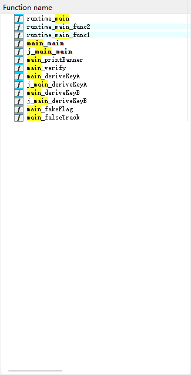

可以看到main函数及后续调用正常显示


### 简单分析整体流程

进入main.main后最重要的就是获取用户输入和验证逻辑

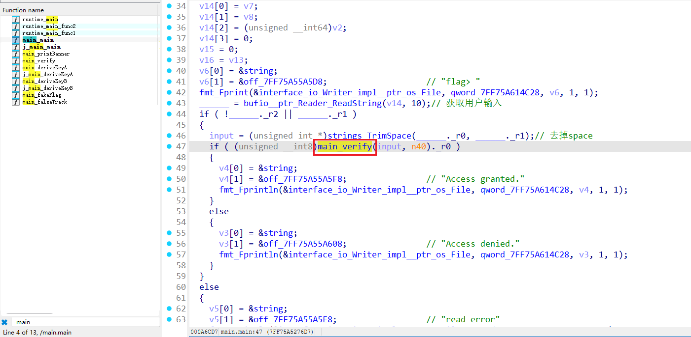

进入校验函数

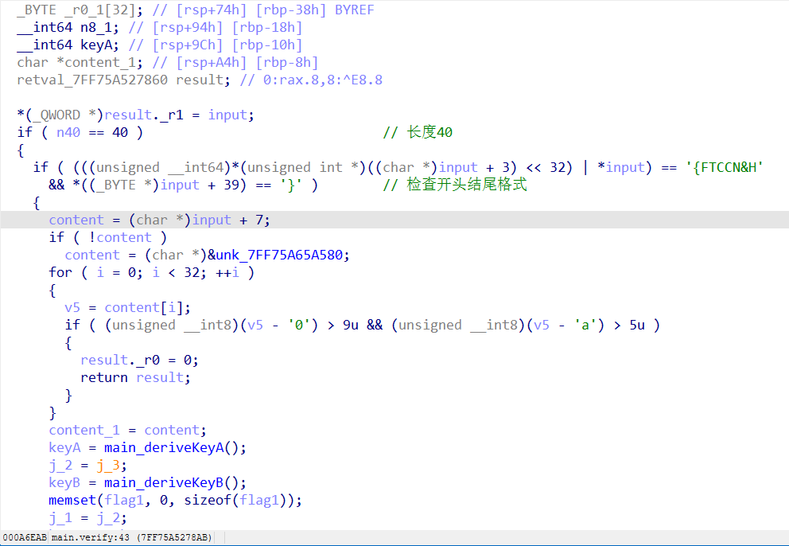

可以看到刚开始校验了输入flag的长度和开头结尾的格式（开头因为小端是反的），然后又校验了输入字符的范围只能是0-9和a-f（这一点有些牵强，不过看不出来也完全不影响，而且字符串中直接搜索flag发现有一个fakeflag有类似形式）


### 加密逻辑分析

#### key生成

首先可以看到生成了两个key，

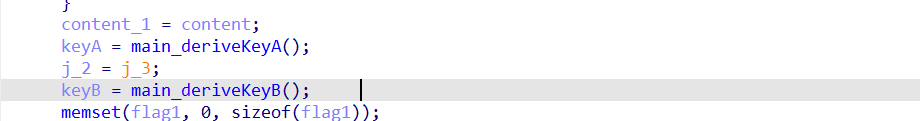

直接分析两个函数有些复杂，但是由于key和输入无关，我们进行动态调试（ida调试+LazyIDA插件）可以拿到两个key（ida的调试可以上网搜索一下）

```python
keyA=[0x6C, 0xC6, 0x76, 0x4D, 0xD7, 0x4E, 0xA6, 0x7B, 0x67, 0x06, 0x39, 0xFD, 0x95, 0xCA, 0x0F, 0x0B, 0xBB, 0xEF, 0xDD, 0x10, 0x8A, 0x1B, 0x5F, 0x0A, 0x63, 0x51, 0x25, 0xD1, 0xBE, 0xC7, 0xA0, 0x27]
keyB=[0x23, 0xA3, 0xB9, 0x2E, 0xA0, 0xF2, 0x64, 0xB2, 0xCC, 0xB8, 0x2A, 0x6C, 0xFF, 0xFE, 0xFA, 0x0F, 0xD9, 0x1C, 0x36, 0xB3, 0x4C, 0x26, 0x52, 0x60, 0xBB, 0x60, 0x36, 0x91, 0xC3, 0xB7, 0x07, 0xF7]
```

#### 三轮加密

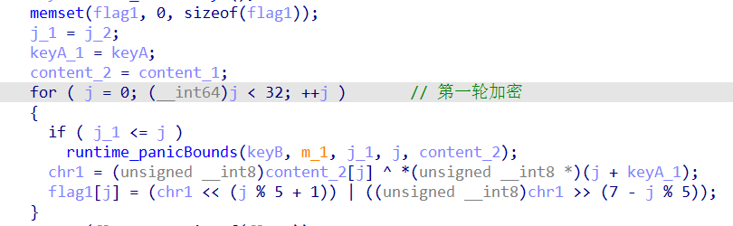

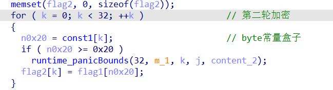

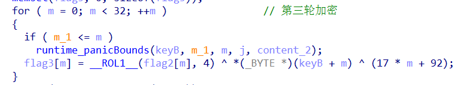

加密流程不再详细分析，是一些box的替换、xor和rol（循环移位）

#### 最终校验

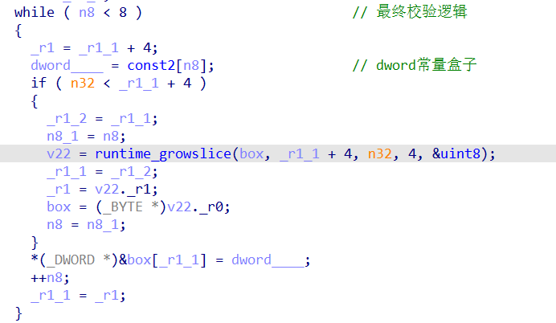

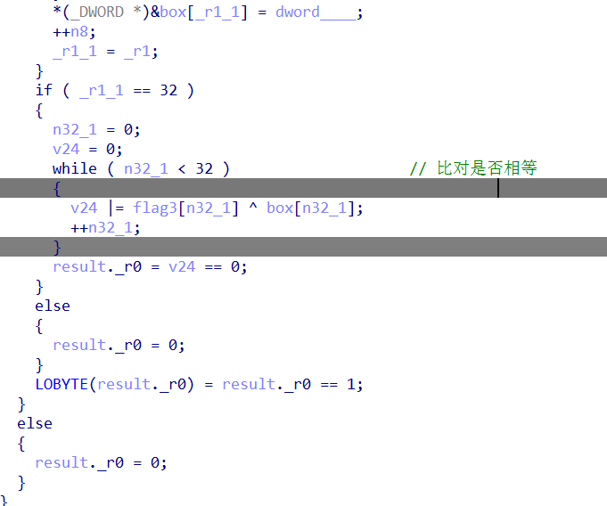

前一步看起来复杂，但是GPT老师说其实只是把dword转换成byte，感觉复杂其实也可以通过下面动态调试直接获取比对的部分

```
const2=[0x1B, 0xA5, 0xD9, 0xAA, 0xC6, 0x51, 0x5D, 0x0D, 0xA4, 0x01, 0x24, 0xA4, 0xAF, 0xF5, 0x7E, 0xD3, 0x49, 0x16, 0x79, 0xDF, 0x89, 0x0C, 0xDF, 0x23, 0xB7, 0x26, 0x11, 0x01, 0x1D, 0xEF, 0x7A, 0x2B]
```


### 解密及脚本

所以最终解密就是从最后比对这部分数据倒着推回flag，也就是逆过来整个加密，最终脚本由GPT完成，但是逻辑比较清晰：

```
keyA=[0x6C, 0xC6, 0x76, 0x4D, 0xD7, 0x4E, 0xA6, 0x7B, 0x67, 0x06, 0x39, 0xFD, 0x95, 0xCA, 0x0F, 0x0B, 0xBB, 0xEF, 0xDD, 0x10, 0x8A, 0x1B, 0x5F, 0x0A, 0x63, 0x51, 0x25, 0xD1, 0xBE, 0xC7, 0xA0, 0x27]
keyB=[0x23, 0xA3, 0xB9, 0x2E, 0xA0, 0xF2, 0x64, 0xB2, 0xCC, 0xB8, 0x2A, 0x6C, 0xFF, 0xFE, 0xFA, 0x0F, 0xD9, 0x1C, 0x36, 0xB3, 0x4C, 0x26, 0x52, 0x60, 0xBB, 0x60, 0x36, 0x91, 0xC3, 0xB7, 0x07, 0xF7]
fakeFlag='H&NCTF{0123456789abcdeffedcba9876543210}'
const1=[0x09, 0x04, 0x15, 0x00, 0x11, 0x1E, 0x0C, 0x19, 0x07, 0x13, 0x02, 0x1C, 0x0E, 0x17, 0x05, 0x1F, 0x01, 0x10, 0x0A, 0x1B, 0x03, 0x12, 0x08, 0x18, 0x0D, 0x1D, 0x06, 0x14, 0x0B, 0x1A, 0x0F, 0x16]
const2=[0x1B, 0xA5, 0xD9, 0xAA, 0xC6, 0x51, 0x5D, 0x0D, 0xA4, 0x01, 0x24, 0xA4, 0xAF, 0xF5, 0x7E, 0xD3, 0x49, 0x16, 0x79, 0xDF, 0x89, 0x0C, 0xDF, 0x23, 0xB7, 0x26, 0x11, 0x01, 0x1D, 0xEF, 0x7A, 0x2B]
target=const2
from struct import pack

# ==========================
# 8bit循环移位
# ==========================

def rol8(x, n):
    n %= 8
    return ((x << n) | (x >> (n))) & 0xff


def ror8(x, n):
    n %= 8
    return ((x >> n) | (x << (8-n))) & 0xff


# ==========================
# 逆第三轮
#
# flag3[i] =
#     rol(flag2[i],4)
#     ^ keyB[i]
#     ^ (17*i+92)
#
# ==========================


flag2 = [0]*32


for i in range(32):

    tmp = target[i] \
          ^ keyB[i] \
          ^ ((17*i+92)&0xff)

    flag2[i] = ror8(tmp,4)


# ==========================
# 逆第二轮
#
# 原:
#
# flag2[k]=flag1[const1[k]]
#
# ==========================


flag1 = [0]*32


for k in range(32):

    flag1[const1[k]] = flag2[k]


# ==========================
# 逆第一轮
#
# 原:
#
# flag1[i]=rol(input[i]^keyA[i], i%5+1)
#
# ==========================


content = []


for i in range(32):

    c = ror8(
        flag1[i],
        i%5+1
    )

    c ^= keyA[i]

    content.append(c)


print("[+] hex:")
print(bytes(content).hex())


print("[+] flag content:")
print(bytes(content).decode())


print("\n[+] full flag:")
print("H&NCTF{" + bytes(content).decode() + "}")
```


最终flag：

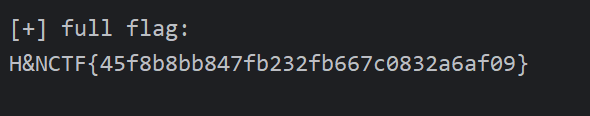


## PatrolNote

首先是一个apk包，先运行一下看看是什么东西，这里我用了Android Studio的Device Manager作为模拟器，打开看到

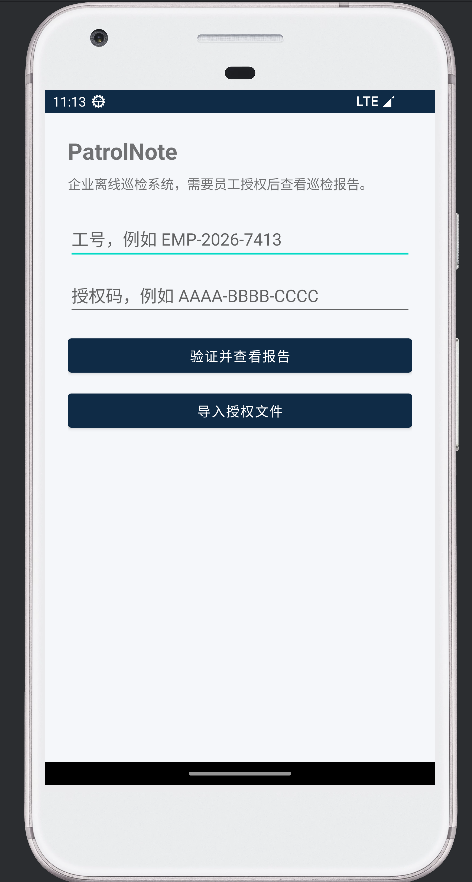

可以看到是一个授权的验证，规定了工号和授权码

接下来我们用jadx来进行反编译（注意这里建议用高版本的jadx，低版本可能无法处理混淆而反编译失败）

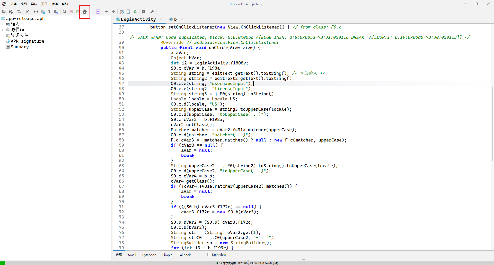

可以直接点击这个小房子定位到MainActivity

可以看到获取usernameInput、licenseInput作为string1和string2

然后将username转成string存入string3，将string3变成大写放到upperCase，接下来调用了一个matcher相关的，问了ai是正则匹配的

打开这个b的类可以看到有两个正则匹配的表达式，应该是规定了username和license的格式，可以看到第一个只匹配最后四位，第二个则是都匹配

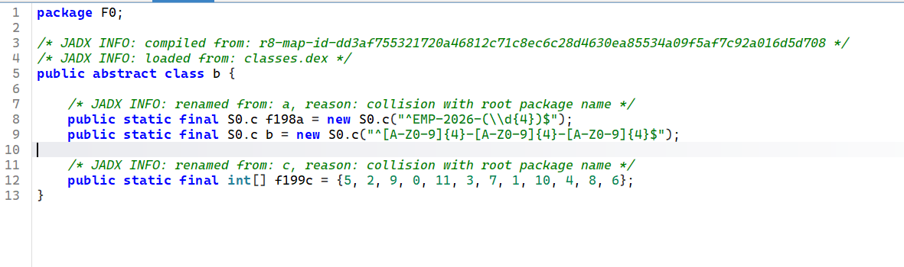

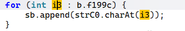

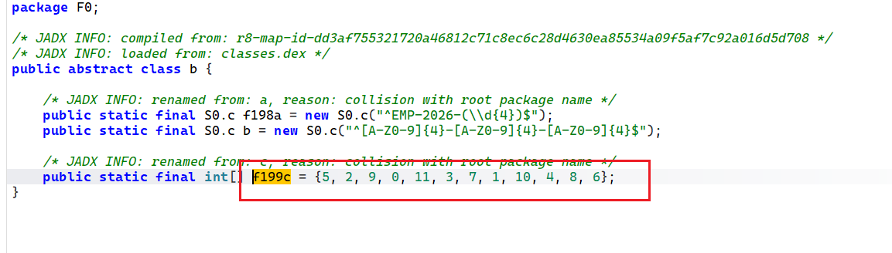

后面就是将两个输入分别处理并提取，其中username只要最后四位数字，license匹配后删除“-”之后进行了换表重排，

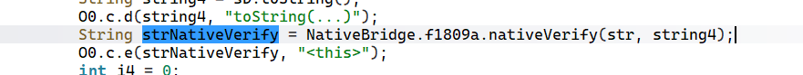

然后就将这两部分传入这个verify函数，这个明显是校验逻辑所在，这个NativeBridge GPT老师说是调用C、C++代码的部分，因此下面用ida打开lib文件夹下的.so文件进行分析，GPT老师说应该找Android JNI 函数，因此搜索java命名的函数即可找到函数调用

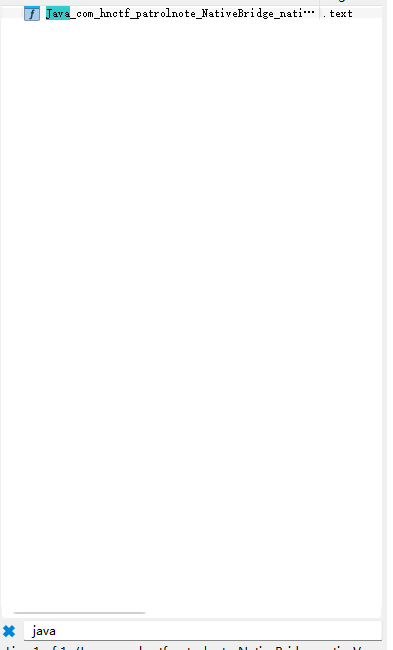

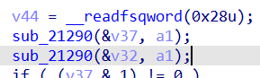

首先这两个函数GPT说可以理解为从java的string转换到C++的string

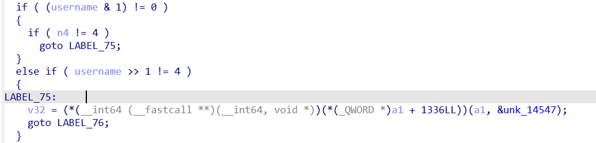

第一个if块很奇怪，GPT：C++ std::string 有短字符串优化（SSO），不用管，恢复成：if(str1.length()!=4) return wrong;

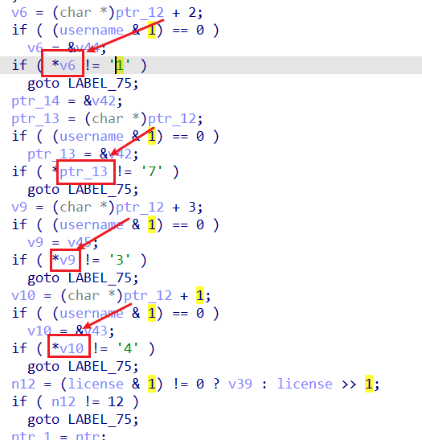

下面就是硬编码对比，可以看到ptr12=‘‘7413’’，也就是username=EMP-2026-7413

在下面的license比对就是“9M5QD2A7KLTX”，根据java层置换回来就是“Q7M2L9XAT5KD”,即“Q7M2-L9XA-T5KD”

输入get flag

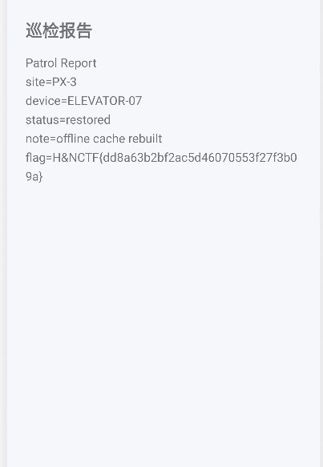


## ezvm

这个题目前还是一知半解，不过根据我的“逻辑”已经可以得到flag

首先安装查看交互逻辑

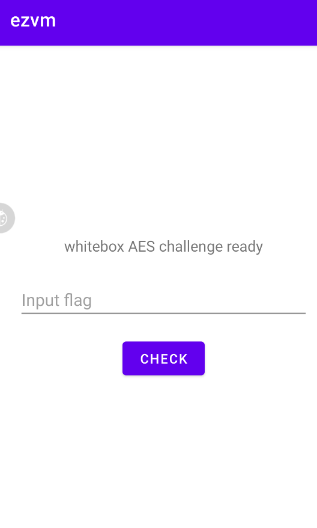

题目提示了AES，用jadx打开进行分析：

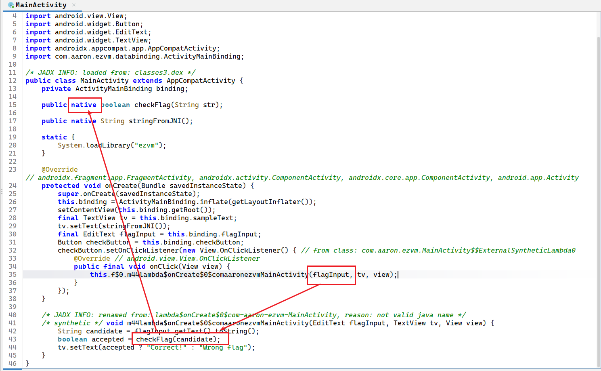

定位MainActivity可以看到关键逻辑在checkFlag，依旧在so文件中，ida打开并搜索checkFlag并交叉引用可以看到函数入口

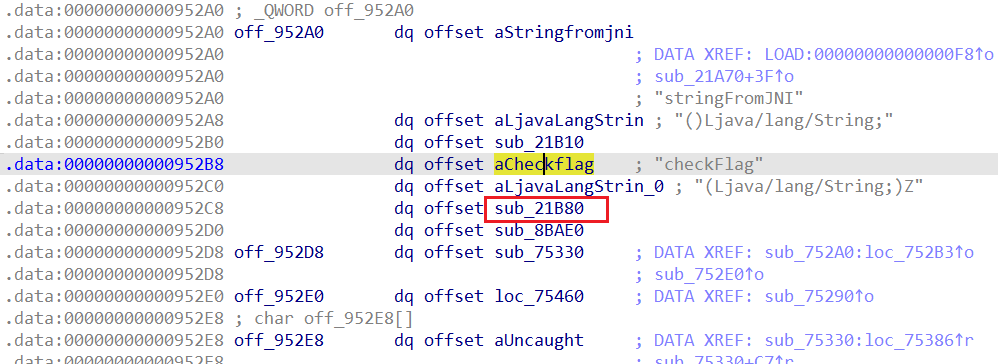

打开这个函数，看到

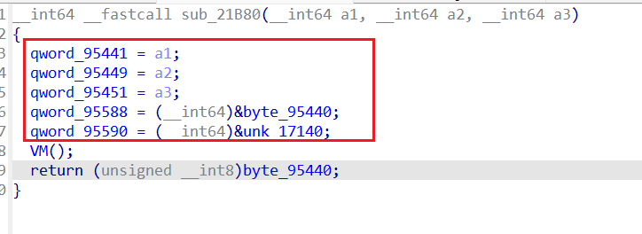

可以猜到0x95440附近都是在设置VM的一些状态参数，如pc等，然后点开可以猜0x17140是自定义code，查看VM内部可以看到十分复杂，

“惊人的观察力”：根据AES用到的box来找AES实现部分，在字符串后面不远处可以找到这样两个box

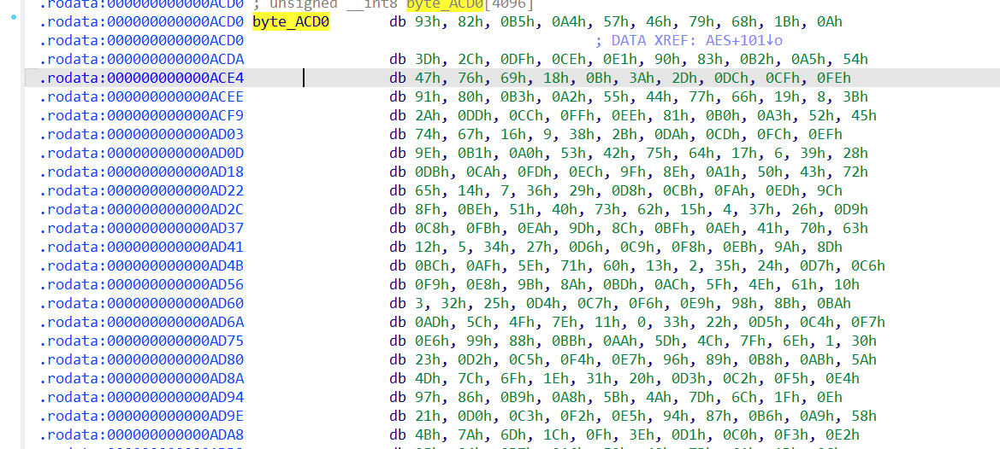

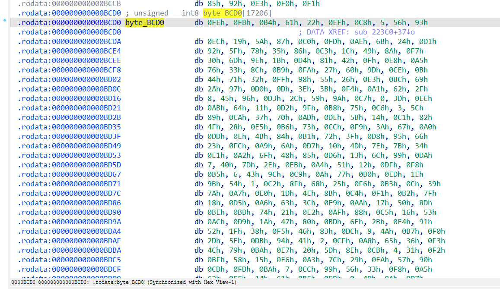

交叉引用可以找到AES主体部分，根据下面容易猜出三个参数含义，也可以看出加密模式是CBC

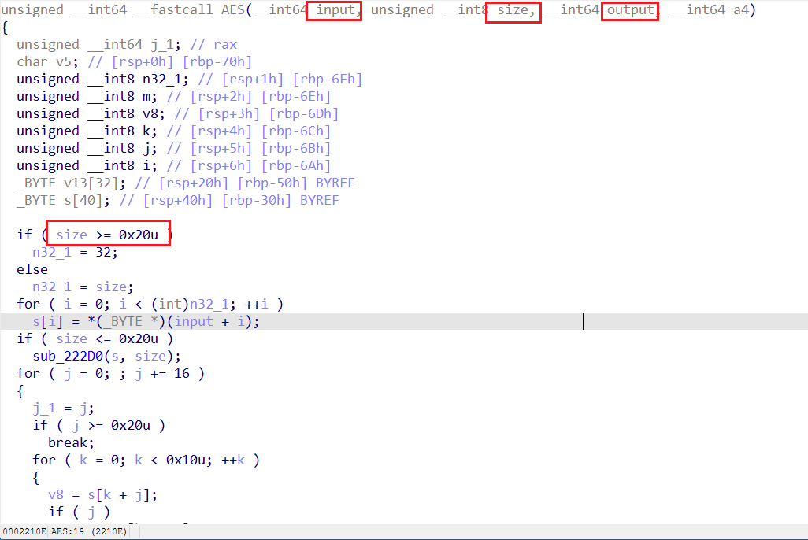

那么现在关键任务是找到AES的key、IV和cipher，下面要用到unicorn来模拟这个流程，因为加密过程又涉及到了复杂的子VM

注意：unicorn不能模拟库函数的调用，还有canary的检测需要单独分配fs寄存器，但是对主逻辑没有影响因此我都给nop掉了

整体流程：明文message xor IV，然后AES加密

### 找IV

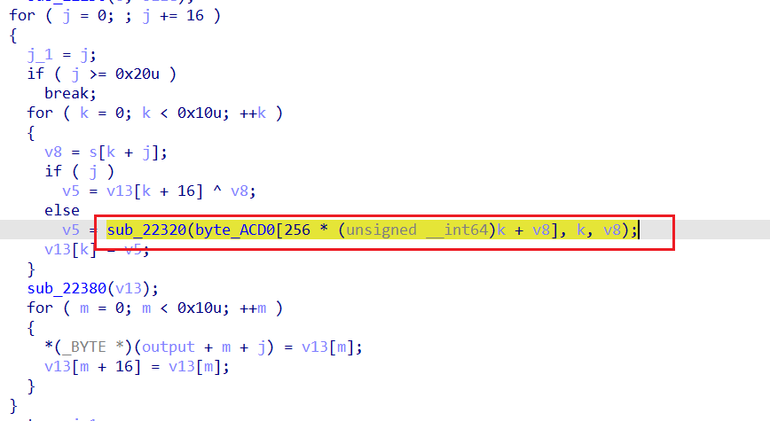

这个函数里面只有异或逻辑，可以猜测其实就是把IV隐藏在了一个盒中，可以用unicorn去执行这一部分，输入message为全0来恢复出IV

结果：vmp-dynamic-reg!

### 找key

根据AES加密流程：字节代换（S盒）、行移位、列混合、轮密钥加

在第一轮输入全0输出就是key本身，因此用unicorn模拟AES中第一轮输入全0的结果可以得到key，现在需要找到轮加密的逻辑，交叉引用另一个S盒

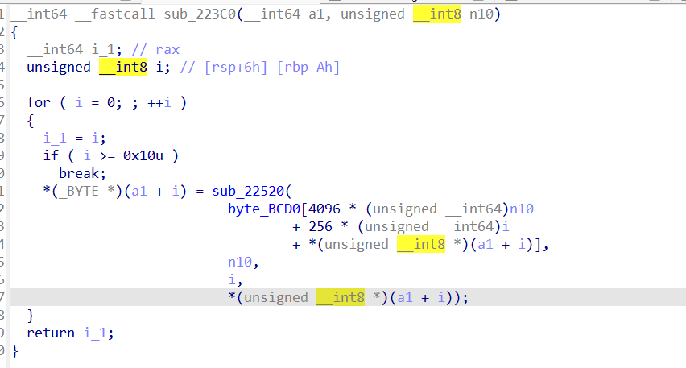

容易猜出第一个参数就是input，交叉引用这个函数也容易猜出第二个参数其实是轮数：

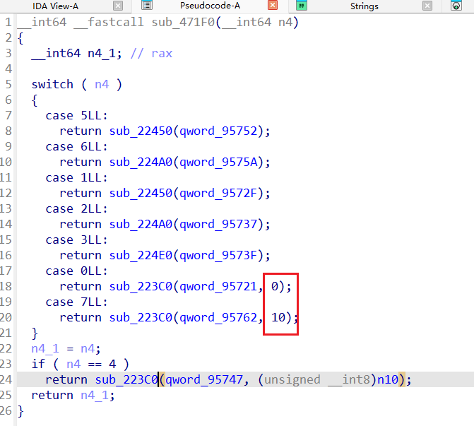

模拟得到key，结果：ezvm-wb-aes-2026

### 找cipher

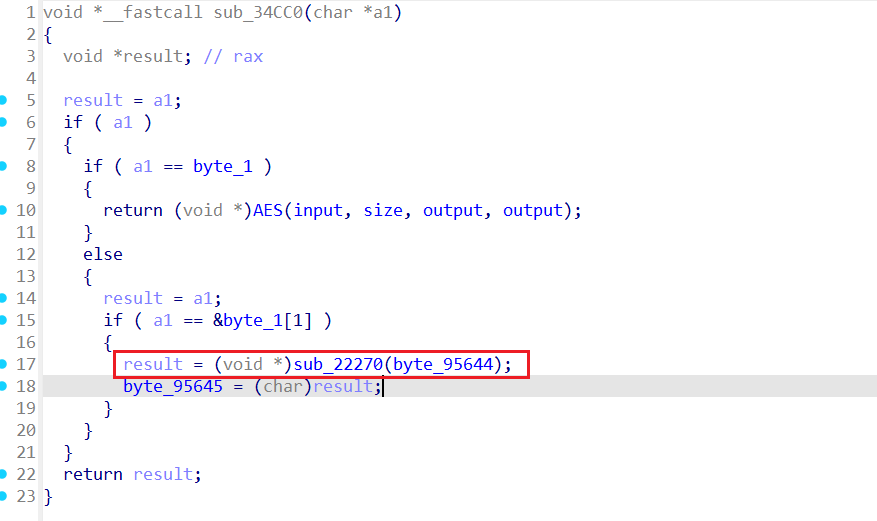

此处wp和GPT说cipher就是sub_22270(byte_95644)，其中byte_95644取0-31的结果，此处有点半蒙半猜，通过调试这个函数每次的输入输出可以猜测是要比较的密文：

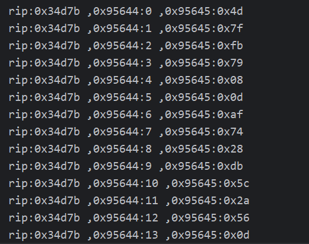

anyway，最终得到unicorn模拟22270函数输入0-31的结果可以得到cipher：

0x4d7ffb79080daf7428db5c2a560d6defa1e6b4d024bb2e419ebe847648087560

### 解密

最终使用cyber chef解密：

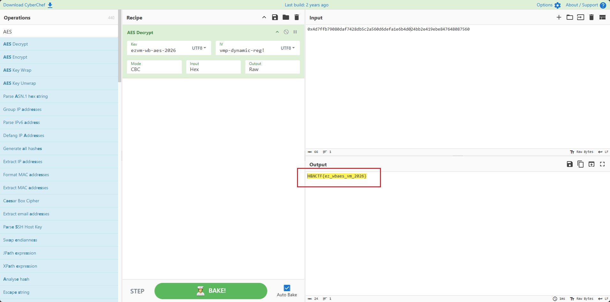

### 完整exp

```python
from unicorn import *
from unicorn.x86_const import UC_X86_REG_RSP, UC_X86_REG_RIP, UC_X86_REG_RDI, UC_X86_REG_RSI, UC_X86_REG_RDX, \
    UC_X86_REG_FS_BASE, UC_X86_REG_RAX

# 创建cpu
mu = Uc(
    UC_ARCH_X86,
    UC_MODE_64
)
# 分配程序内存
image_base=0x0
image_size=0x10000*0x10
mu.mem_map(
    image_base,
    image_size
)
binary=open('lib.so','rb').read()
mu.mem_write(image_base,binary)
# 分配栈内存
stack_base=image_base+image_size
stack_size=0x10000
stack_top=stack_base+stack_size-0x100
mu.mem_map(stack_base,stack_size)
mu.reg_write(UC_X86_REG_RSP,stack_top)
# 分配常量段
data_base=stack_base+stack_size
data_size=0x10000
mu.mem_map(data_base,data_size)
# HOOK

# def hook_code(uc,address,size,user_data): # 这个用来调试sub_22270的输入输出
#     print(f"rip:{hex(address)} ,0x95644:{mu.mem_read(image_base+0x95644, 1)[0]} ,0x95645:0x{mu.mem_read(image_base+0x95645, 1)[0]:02x}")
# mu.hook_add(UC_HOOK_CODE,hook_code,0,0x34D7B,0x34D7B)

# def hook_memory(uc,access,address,size,value,user_data):
#     rip = uc.reg_read(UC_X86_REG_RIP)
#     print("memory error: rip:0x%x address:0x%x size:0x%x value:0x%x"%(rip,address,size,value))
# mu.hook_add(UC_HOOK_MEM_UNMAPPED,hook_memory,0)
# def hook_mem_invalid(uc, access, address, size, value, user_data):
#     rip = uc.reg_read(UC_X86_REG_RIP)
#
#     try:
#         code = bytes(uc.mem_read(rip, 16))
#         code_hex = code.hex()
#     except Exception:
#         code_hex = "<cannot read>"
#
#     print(f"[!] Invalid memory access")
#     print(f"    RIP     = {rip:#x}")
#     print(f"    address = {address:#x}")
#     print(f"    size    = {size}")
#     print(f"    code    = {code_hex}")
#
#     return False
#
#
# def hook_invalid_insn(uc, user_data):
#     rip = uc.reg_read(UC_X86_REG_RIP)
#     code = bytes(uc.mem_read(rip, 16))
#
#     print(f"[!] Invalid instruction at RIP={rip:#x}")
#     print(f"    code={code.hex()}")
#
#     return False
# mu.hook_add(UC_HOOK_MEM_INVALID, hook_mem_invalid)
# mu.hook_add(UC_HOOK_INSN_INVALID, hook_invalid_insn)
# 模拟

# 输入全0得到key
mu.mem_write(data_base,b'\x00'*0x1000)
mu.reg_write(UC_X86_REG_RDI,data_base)
mu.reg_write(UC_X86_REG_RSI,0)
start=image_base+0x223C0
end=image_base+0x2244E
mu.emu_start(start,end)
print("key:",mu.mem_read(data_base,0x20))

# 得到IV
mu.mem_write(data_base,b'\x00'*0x1000)
mu.reg_write(UC_X86_REG_RDI,data_base)
mu.reg_write(UC_X86_REG_RSI,32)
mu.reg_write(UC_X86_REG_RDX,data_base+0x100)
start=image_base+0x22080
# end=image_base+0x223C0
end=image_base+0x221DE
mu.emu_start(start,end)
print("IV:",mu.mem_read(mu.reg_read(UC_X86_REG_RDI),0x20))

# 跟踪得到cipher
TARGET_BYTE_FUNC_START = image_base + 0x22270
TARGET_BYTE_FUNC_END = image_base + 0x222CA

cipher = bytearray()
print('cipher:0x',end="")
for i in range(32):
    mu.reg_write(UC_X86_REG_RDI, i)
    mu.emu_start(TARGET_BYTE_FUNC_START,TARGET_BYTE_FUNC_END)
    print("%02x"%(mu.reg_read(UC_X86_REG_RAX)&0xFF),end="")

# # 查看sub_22270逻辑
# FUNC_START = image_base + 0x21FE0
# FUNC_END = image_base + 0x2203D
#
# mu.emu_start(FUNC_START,FUNC_END)
```


## mov-add

### 题目检查

首先用die检测发现是elf64

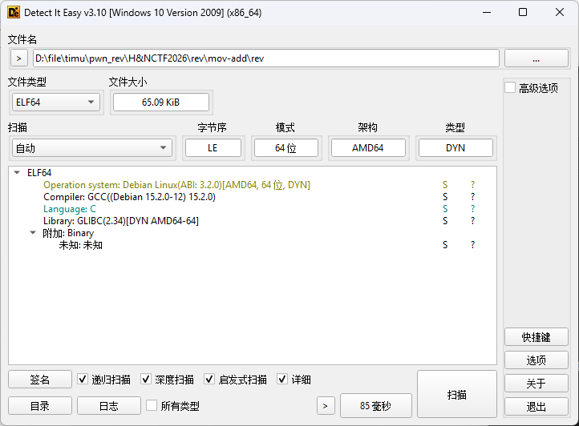

先运行测试一下交互逻辑

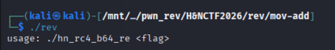

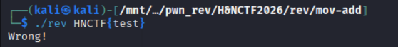

发现给出了用法，并且暗示了rc4和base64加密，

用ida打开分析，先查看字符串

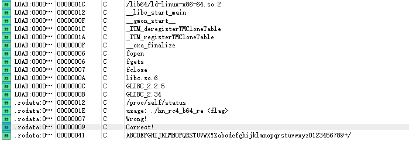

发现了一些可能有用的字符串

查看main函数

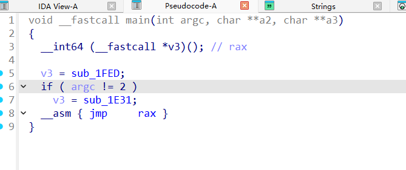

发现检查了argc，只有argc是2也就是程序后面有flag作为参数才正常运行，因此可以命名两个函数分别为real_main和ussage

可以打开查看一下ussage发现有强混淆，主要集中在函数地址的运算上面

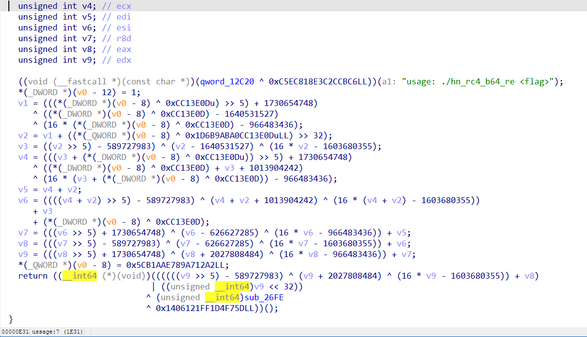

查看real_main发现只有两处调用

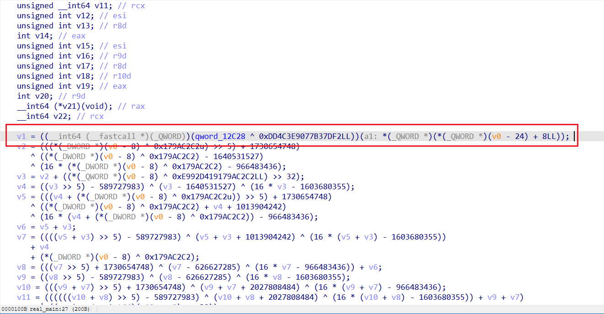

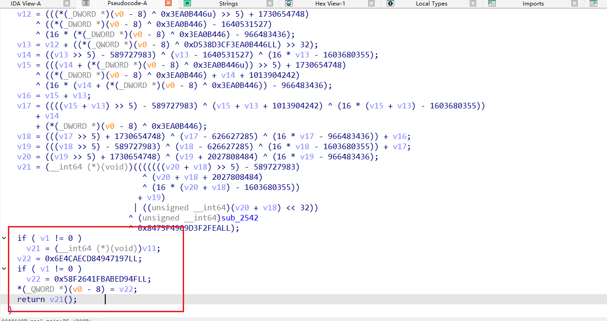

第一处调用给v1赋值，第二处根据v1跳转，可以猜到分别是正确和错误的跳转

可以随便输入一个flag并打上断点发现v1为0是错误的逻辑，跳转到了如下函数

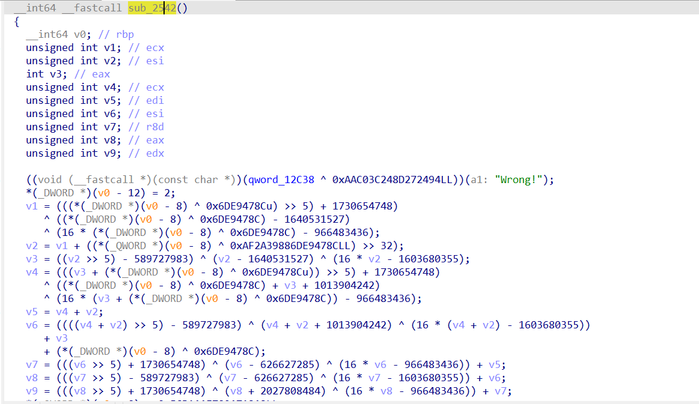

可以看出这个函数其实只是打印一个wrong，那么就可以根据字符调用更改错误函数为wrong，正确函数为correct，下面分析这个关键给v1赋值的函数调用，打上断点发现跳转到了，可以将函数改名为check_top

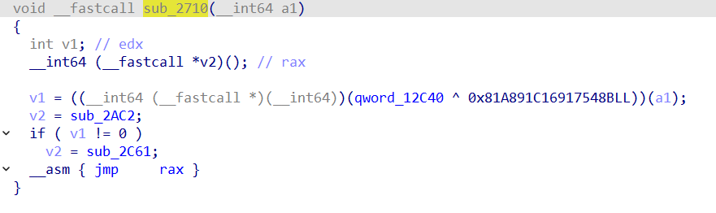

### pre_check

依旧打断点发现第一个调用是

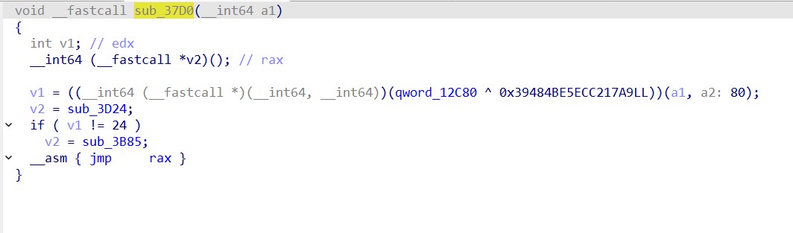

检查v1是否是24，可以猜测是长度，变化长度打断点观察返回值可以确定，改名函数为check_len，并查看3d24处的下一个check逻辑

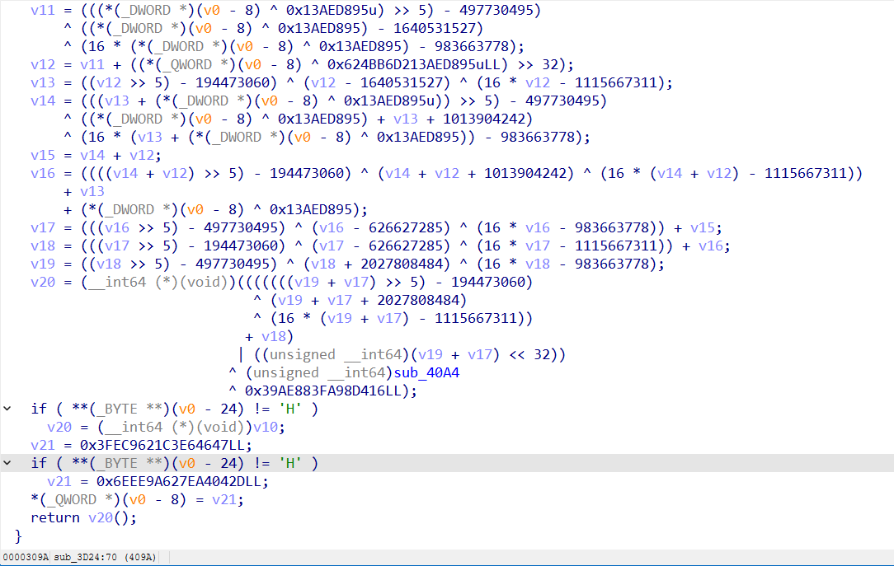

前面还是混淆计算跳转地址，但是最后是判断一个东西是否是'H'，这里可以猜到是第一个字符的检查，也可以变化flag打断点验证，之后的跳转都是固定的字符检查,分别检查了H&NCTF{}

sub_3D24 -> sub_40A4 -> sub_4425 -> sub_47A6 -> sub_4B27 -> sub_4EA8 -> sub_5229 -> sub_55AA

### real_check

在之后就跳转到了5ACA然后5C69，如果前面都是对的就返回了1，就一下返回到了check_top这里要到sub_2C61（改名为real_check）去，可以发现里面调用到了很多函数

注意：其实到这里也可以发现一些混淆的套路了，混淆主要是在计算下一跳函数地址，然后每次条件判断、循环内部甚至返回值函数都要单独整一个函数，然后通过复杂的混淆跳转或者调用，其实真正的逻辑没几句，只需关注每个函数里面的前几句逻辑和调用，后面的混淆直接忽略

#### generate key

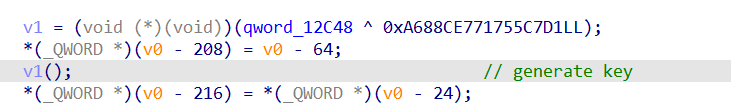

跟踪到5C80->5E35

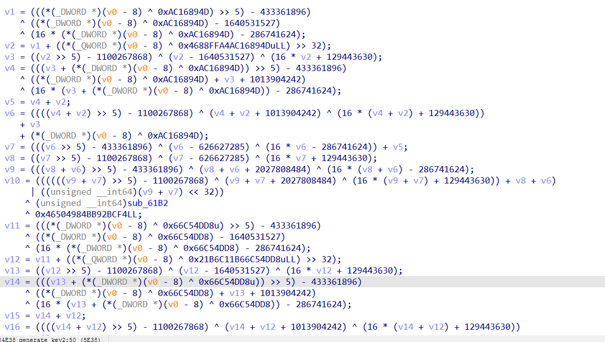

看到这些数字不用在意，直接往下翻，看到


其实只是一个25次循环，有两个跳转，分别看两个函数，其实ida已经通过不同颜色进行标注了，很容易看到是以下两个


打开第一个，真正的逻辑只有上面的一句。


可以通过调试看内容变化，发现是key。下面一个


其实就是循环的次数i进行+1，然后就回到循环判断那个函数了，跟踪循环的另一个函数其实只是pop，ret返回

#### anti_debug

这个是反调试的部分，

“

/proc/self/status，这是 Linux 下记录当前进程状态信息的文件。

其中 TracerPid 字段常用于反调试判断。如果 TracerPid 为 0，说明当前进程没有被调试；如果不为 0，说明进程正在被 gdb、strace 等工具跟踪。

”


#### change input

后面的方法与前面类似，我直接贴图标注重点

这个部分是对输入进行混淆


#### RC4

初始化 S 盒


循环结束进入下一个（中间忽略了几个函数，只是跳转），KSA，根据 key 打乱 S 盒


循环结束又进入下一步，PRGA，对 change 数组原地异或


#### 魔改的base64

这个比较阴，前面的函数调用跟进去是打乱table，需要动调提取，后面jmp才是再次加密


加密部分逻辑比较复杂，其实可以不用跟踪进去，用替换表的base64验证一下没问题即可（具体就是用动调拿到base64加密后串，用替换表的base64解密，再与动调拿到的RC4加密之后的原始数据进行比较，一样说明没毛病）

#### 还原密文

这个和前面差不多的分析方法，进去之后发现循环是32字节，和密文长度一样，发现这一句


这个复杂的数学关系直接通过动调恢复发现是个密文（为什么呢，因为就算变换输入这个串也不变）

#### compare

最后的return的函数就是比较了，


计算每一位异或结果（只有相等才为0），再将每一位或起来即可判断是否完全一致

### 伪代码及wp

```c
int main(){
    int argc; // 传参数量
    if (argc==2){
        // usage函数
        printf("usage: ./hn_rc4_b64_re <flag>");
    }
    // real_main
    if(check_top()){
        printf("correct");
    }
    else{
        printf("wrong");
}

int check_top(){
    if(pre_check()){
        return real_check(); // 主要逻辑
    }
    else{
        return 0;
    }
}

int pre_check(){
    if(strlen(flag)==24){
        // check_format
        if(flag[0-6]=="H&NCTF{"&&flag[23]=='}'){
            return 1;
        }
        else{
            return 0;
        }
    }
}

int real_check(){
    // generate key
    key="H&NCTF-RC4-Base64-CFG-Key";
    anti_debug();
    // change input
    for(int i = 0; i < 24; i++){
        int idx = (5 * i + 11) % 24;
        byte b = input[idx];

        b ^= (seed + 37 * i + 93) & 0xff;

        // IDA 里可能显示成 ror8，但实际公式是：
        // (b >> (8 - shift)) | (b << shift)
        // 所以这是 rol8。
        int shift = i % 7 + 1;
        b = rol8(b, shift);

        b = (b + 19 * i - 65) & 0xff;
        change[i] = b;
    }
    // RC4
    byte box[0x100];
    for(int i = 0; i < 0x100; i++){
        box[i] = i;
    }
    byte a=0;
    for(int i = 0; i < 0x100; i++){
        a=key[i%25]+box[i]+a;
        swap(box[i],box[a]);
    }
    byte a,b,c=0;
    for(int i=0;i<24;i++){
        a+=box[i+1];
        b=box[i+1];
        swap(box[a],box[b]);
        change[i]^=box[box[a]+box[b]];   // 都是byte
    }
    // b64
    // 表置换与base64加密
    table="HUhu7IViv8JWjw9KXkx+LYly/MZmzANan0BObo1CPcp2DQdq3ERer4FSfs5GTgt6"
    // 密文还原
    cipher="GFw1PxXVINaMgcW+0IjTpOEMlEVCPDNvslNdPLWmI96M0D1L0I9V7cEMlF5nujNv"
    //compare
}
```

最终wp：

```python
# -*- coding: utf-8
import base64

STANDARD_ALPHABET = b'ABCDEFGHIJKLMNOPQRSTUVWXYZabcdefghijklmnopqrstuvwxyz0123456789+/'
CUSTOM_ALPHABET = b'HUhu7IViv8JWjw9KXkx+LYly/MZmzANan0BObo1CPcp2DQdq3ERer4FSfs5GTgt6'
ENCODE_TRANS = bytes.maketrans(STANDARD_ALPHABET, CUSTOM_ALPHABET)
DECODE_TRANS = bytes.maketrans(CUSTOM_ALPHABET, STANDARD_ALPHABET)

def encode(input):
  return base64.b64encode(input).translate(ENCODE_TRANS)

def decode(input):
  return base64.b64decode(input.translate(DECODE_TRANS))

enstr = b'GFw1PxXVINaMgcW+0IjTpOEMlEVCPDNvslNdPLWmI96M0D1L0I9V7cEMlF5nujNv'[0:32]
# enstr=b'slNdPLWmI96M0D1L0I9V7cEMlF5nujNv' # 测试代码用
debyte=decode(enstr)
dehex = debyte.hex()
print('base64:0x'+dehex)

def rc4(data: bytes, key: bytes) -> bytes:
    S = list(range(256))

    j = 0
    for i in range(256):
        j = (j + S[i] + key[i % len(key)]) & 0xff
        S[i], S[j] = S[j], S[i]

    i = 0
    j = 0
    out = bytearray(data)

    for k in range(len(out)):
        i = (i + 1) & 0xff
        j = (j + S[i]) & 0xff

        S[i], S[j] = S[j], S[i]

        t = (S[i] + S[j]) & 0xff
        out[k] ^= S[t]

    return bytes(out)

debyte_rc4 = rc4(debyte, b"H&NCTF-RC4-Base64-CFG-Key")
print("rc4:",debyte_rc4.hex())

def ror8(x, n):
    n &= 7
    return ((x >> n) | (x << (8 - n))) & 0xff


def inv_change(changed: bytes, seed=0) -> bytes:
    flag = bytearray(24)

    for i in range(24):
        idx = (5 * i + 11) % 24

        b = changed[i]

        b = (b - 19 * i + 65) & 0xff
        b = ror8(b, i % 7 + 1)
        b ^= (seed + 37 * i + 93) & 0xff

        flag[idx] = b

    return bytes(flag)

print("flag:",inv_change(debyte_rc4))
```

get flag：


## shell

题目是64位elf，名字提示了vmp（是一种**高强度的软件壳保护技术**，全称为Virtual Machine Protect，核心是通过虚拟指令集来混淆和保护软件核心代码，防止被逆向分析或破解）,obf：Obfuscation代码混淆

可以先运行一下查看交互逻辑


可以看到是校验

用ida分析


可以看到从start开始就进行了混淆，后面是一些杂乱的跳转，所以题目的关键是找到核心的加密校验逻辑

现学现用的一些小技巧：打断点到系统调用mprotect和fgets，因为程序是运行过程中才把代码读入内存，然后设置可执行权限

我们尝试打在fgets（因为尝试mprotect有点多，大多没什么用）


执行finish跳出系统调用并随便输入一个


可以看到程序正常代码段在0x600000-0x89a000，但是跳到了0x201b19上面，并且下面可以看到输入和wrong的提示字符串，可以猜测下面就是校验的逻辑了

用以下命令可以将此时内存的数据dump出来进行静态分析：

```bash
gcore core.dump
```

可以再运行两步看看逻辑


到这里发现了pre_check的逻辑，即先校验输入长度

用ida打开这个core.dump定位到此处开始分析（此处strlen是自己命名）


可以发现这里进行了check，检查了长度、开头、结尾格式

后面有一个循环，长度和flag一样，仔细查看发现就是把flag的相邻两位xor并和cipher比较，动调可以看到前两位都是正确的，说明其实这里就能恢复出来flag了（根据第一位是H）

将byte_20071F数组用lazyida给dump出来直接恢复即可

代码如下：

```python
# test_flag="H&NCTF{"
# test_flag=test_flag+'a'*(40-len(test_flag)-1)
# test_flag+='}'
# print(len(test_flag))
# print(test_flag)
# print(test_flag.encode().hex())
flag="H"
cipher=[0x00, 0x6E, 0x68, 0x0D, 0x17, 0x12, 0x3D, 0x03, 0x17, 0x1D, 0x2D, 0x3C, 0x0B, 0x09, 0x08, 0x07, 0x31, 0x29, 0x1B, 0x32, 0x30, 0x0D, 0x04, 0x39, 0x3A, 0x04, 0x12, 0x0A, 0x26, 0x2D, 0x17, 0x13, 0x29, 0x6D, 0x02, 0x02, 0x04, 0x17, 0x00, 0x5C, 0x00, 0x01, 0x1B, 0x03, 0x3B, 0x34, 0x00, 0x00, 0x00, 0x05, 0x00, 0x00, 0x00, 0x38, 0x11, 0x00, 0x00, 0x50, 0x00, 0x00, 0x00, 0x68, 0x11, 0x00, 0x00, 0x80, 0x00, 0x00, 0x00, 0x38, 0x12, 0x00, 0x00, 0x94, 0x00, 0x00, 0x00, 0x78, 0x12, 0x00, 0x00, 0xB0, 0x00, 0x00, 0x00, 0x58, 0x13, 0x00, 0x00, 0xD4, 0x00, 0x00, 0x00, 0x00, 0x00, 0x00, 0x00, 0x14, 0x00, 0x00, 0x00, 0x00, 0x00, 0x00, 0x00, 0x01, 0x7A, 0x52, 0x00, 0x01, 0x78, 0x10, 0x01, 0x1B, 0x0C, 0x07, 0x08, 0x90, 0x01, 0x07, 0x10, 0x14, 0x00, 0x00, 0x00, 0x1C, 0x00, 0x00, 0x00, 0xE0, 0x10, 0x00, 0x00, 0x22, 0x00, 0x00, 0x00, 0x00, 0x00, 0x00, 0x00, 0x00, 0x00, 0x00, 0x00, 0x14, 0x00, 0x00, 0x00, 0x00, 0x00, 0x00, 0x00, 0x01, 0x7A, 0x52, 0x00, 0x01, 0x78, 0x10, 0x01, 0x1B, 0x0C, 0x07, 0x08, 0x90, 0x01, 0x00, 0x00, 0x10, 0x00, 0x00, 0x00, 0x1C, 0x00, 0x00, 0x00, 0xE0, 0x10, 0x00, 0x00, 0x01, 0x00, 0x00, 0x00, 0x00, 0x00, 0x00, 0x00, 0x18, 0x00, 0x00, 0x00, 0x30, 0x00, 0x00, 0x00, 0x9C, 0x11, 0x00, 0x00, 0x3D, 0x00, 0x00, 0x00, 0x00, 0x41, 0x0E, 0x10, 0x83, 0x02, 0x7B, 0x0E, 0x08, 0x00, 0x00, 0x00, 0x20, 0x00, 0x00, 0x00, 0x4C, 0x00, 0x00, 0x00, 0xC0, 0x11, 0x00, 0x00, 0xD1, 0x00, 0x00, 0x00, 0x00, 0x41, 0x0E, 0x10, 0x83, 0x02, 0x4E, 0x0E, 0x20, 0x02, 0xA9, 0x0A, 0x0E, 0x10, 0x44, 0x0E, 0x08, 0x41, 0x0B, 0x00, 0x24, 0x00, 0x00, 0x00, 0x70, 0x00, 0x00, 0x00, 0x7C, 0x12, 0x00, 0x00, 0xC7, 0x00, 0x00, 0x00, 0x00, 0x41, 0x0E, 0x10, 0x83, 0x02, 0x4F, 0x0E, 0x90, 0x01, 0x02, 0x97, 0x0A, 0x0E, 0x10, 0x41, 0x0E, 0x08, 0x41, 0x0B, 0x00, 0x00, 0x00, 0x00, 0x00, 0x00, 0x00, 0x00]
for i in range(40):
    flag+=chr(ord(flag[i])^cipher[i+1])
flag=flag[:-1]
print(flag)
```


## game

解压发现是一个塔防游戏，可以用CE以图片中闪电为变量搜索并修改，第一关比较容易通过，发现给出了一部分flag


于是一种解法是通过通关所有关卡得到完整flag（用CE修改即可），但是时间较长，这里主要说明另一种

首先根据文件夹名称容易搜寻到是“Mono打包的Unity游戏”，主要逻辑在game/managed下的**Assembly-CSharp.dll**中，分析工具是dnSpy

用dnSpy打开不难发现flag逻辑在


可以看到flag用level进行分段，每一段来源于CipherTexts的base64解码然后再根据生成的key进行RC4解密

注意这里易错的点是level是1-5而不是0-4，这从"CtfFlagChallenge.FragmentCipherTexts[levelIndex - 1]"的数组下标可以分析得到

编写脚本解密即可

```python
from base64 import b64decode
from Crypto.Cipher import ARC4
ciphertext=[
          "dCQ0aeTWu+M=",
          "IrV0QzjF+p4=",
          "+Y+SXYILQ2U=",
          "0jTBuKupi5A=",
          "6ndQ+FXKPLk="
       ]
keyseed=[67,17,154,5,126,211,44,97]
keymask=[24,39,53,74,89,108,114,143]

def build_key(level):
    array = [0] * (len(keyseed) + 4)
    for i in range(len(keyseed)):
        array[i]=(keyseed[i]^keymask[i])^((level+3)*(i+11)&255)
    array[len(keyseed)]=(49+level*3)&0xff
    array[len(keyseed)+1]=(87^level)&0xff
    array[len(keyseed)+2]=(160-level*7)&0xff
    array[len(keyseed)+3]=(92+level*5)&0xff
    print(f"level{level}:",array)
    return array

flag=''

for level, ciphertext in enumerate(ciphertext, start=1):
    key = bytearray(build_key(level))
    cipher = ARC4.new(key)

    fragment = cipher.decrypt(
        b64decode(ciphertext)
    ).decode("utf-8")

    print(f"level {level}")
    print(f"key      = {key.hex()}")
    print(f"fragment = {fragment}")

    flag += fragment

print("full flag =", flag)
```


## entropybox

先用die检查


发现是elf64，运行查看交互逻辑


用ida打开发现main函数分析


刚开始注册了一个handler函数，在后面BUG()也就是ud2指令会触发

之后进行反调试


“”“

/proc/self/status，这是 Linux 下记录当前进程状态信息的文件。

其中 TracerPid 字段常用于反调试判断。如果 TracerPid 为 0，说明当前进程没有被调试；如果不为 0，说明进程正在被 gdb、strace 等工具跟踪。

”“”


这里我把test rbp,rbp改成test eax,eax（因为前面已经xor，eax一定是0）从而使得is_debug恒为0，不会因为调试而影响逻辑


紧接着获取输入并计算输入长度（v6是输入长度，可以从后面的检查来验证）


中间这里进行了一大堆运算，但是似乎与输入毫无关系，只是利用一些全局变量更改一些全局变量

随后这里又一次反调试


“”“

`**ptrace(PTRACE_TRACEME, 0, 1, 0)**`**，这是 Linux 下进程自我跟踪的系统调用。**

其中 `PTRACE_TRACEME` 请求的含义是：让当前进程声明自己愿意被父进程跟踪（trace me）。

- 如果当前进程**没有被其他调试器跟踪**，这个调用会**成功返回 0**，此时 `(0 >> 63) & 1` 的结果为 **0**。
- 如果当前进程**已经被 gdb、strace 等调试器跟踪**，一个进程只能被一个 tracer 跟踪，调用 `ptrace(PTRACE_TRACEME)` 会**失败返回 -1**（在 64 位系统上，-1 的补码表示为 `0xFFFFFFFFFFFFFFFF`），此时 `(-1 >> 63) & 1` 的结果为 **1**。

”“”


这里我直接将这个and eax,1改为了xor eax,eax，保证了is_debug恒为0


后面又进行了一些运算，随后检查了一个全局变量是否为16和输入长度是否是40


可以看到这个变量每次进入handler函数就会加1，因此这里也可以看作是反调试，如果gdb调试用c直接跳过是有可能没有进入处理函数的

“”“

`c` 是否会把 `SIGILL` 交给程序，取决于 GDB 当前的信号处理策略。

先查看：

```text-x-trilium-auto
info signals SIGILL
```

你可能会看到类似：

```text-x-trilium-auto
Signal  Stop  Print  Pass to program
SIGILL  Yes   Yes    No
```

最关键的是最后一列：

```text-x-trilium-auto
Pass to program
```

如果它是 `No`，那么 GDB 截获 `SIGILL` 后不会把信号交给目标程序。

此时即使你输入：

```text-x-trilium-auto
c
```

程序自己的 `sub_401A30` 也可能没有被调用。

正确设置是：

```text-x-trilium-auto
handle SIGILL nostop noprint pass
```

含义分别是：

```text-x-trilium-auto
nostop：发生 SIGILL 时 GDB 不要停下来
noprint：不要每次都打印 SIGILL 信息
pass：把 SIGILL 交给目标程序
```

”“”


再之后就是将之前的运算结果和输入进行比较了（xor就是比较嘛），所以前面运算应该是将真正的flag解密出来

调试到这里就能看到结果了


## And You

### 前置分析

安装运行apk可以看到是校验Access Key


用jadx分析


发现MainActivity中都是native函数，但是并不能看到从哪里加载，于是搜索loadLibrary发现这两个类


跟着GPT发现AndroidManifest.xml中aplication中有这个EpicVm类


说明了启动流程

```
APK 进程启动
  ↓
创建 arm.EpicVm
  ↓
执行 EpicVm 静态代码块
  ↓
System.loadLibrary("yipro")
  ↓
加载 libyipro.so
  ↓
执行 libyipro.so 的 JNI_OnLoad
  ↓
再创建 MainActivity
```

这就能解释为什么 `MainActivity` 自己没有：System.loadLibrary("yipro");因为应用启动时，`EpicVm` 已经提前加载它了。

真实逻辑已经被`libyipro.so` 虚拟化，所以Bridge.verify并不能找到在哪里调用，优先分析libengine.so，因为其中verify最核心

### libengine.so分析


进入发现Java_com_aurora_notes_Bridge_verify，里面调用了许多lua的函数，可以猜到其实真正校验逻辑在lua中


其中luaL_loadbufferx加载"loader.dex"(实为 Lua 字节码)，名字伪装成 @assets/loader.dex

lua_pcallk执行脚本 → 得到 1 个 Lua 函数(真正的 verify)

lua_pushstring负责push input，然后lua_pcallk(L, 1, 2, 0)校验并返回校验结果

### 恢复luac文件


发现文件头还是dex，根据这篇对luac文件的分析可以[Lua程序逆向之Luac文件格式分析 - 知乎](https://zhuanlan.zhihu.com/p/30094117)发现**luac_tail**的"**\x19\x93\r\n\x1a\n**"标志仍然存在，

虽然标准lua开头的1B 4C 75 61 53 00（其中53代表版本）已被覆盖，但是可以根据so文件的string判断版本


恢复头部信息（将前八字节变成lua对应的六字节）发现还是无法用luac命令解析，说明后面其实也被混淆了，


跟着这篇文章[2026 H&NCTF全解 WP - 信息安全知识库](https://www.gm7.org/archives/120797)去逆向luaU_undump这个被魔改的字节码加载器来反混淆


可以看到这个解释器各个字段都有不同的混淆（需要写lua的反混淆解释器，吓哭了），借助文章和AI写出以下脚本恢复逻辑

```python
#!/usr/bin/env python3
"""
Lua 5.3 反混淆字节码反汇编器（H&NCTF2026 AndYou）
输入: 当前目录下的 `lua` 文件（前8字节 dex magic 已删除，替换为 lua 标准6字节头 \x1bLua\x53\x00）
解密逻辑逆向自 libengine.so: f_parser / luaU_undump / LoadFunction / LoadString
"""
import struct

# ---------- mut_key32_0 表：libengine.so 文件偏移 0x674c，100 个 u32（400 字节） ----------
# 说明: 该 so 的 PT_LOAD 将 vaddr=0 映射到 offset=0，故 VA 0x674c == 文件偏移 0x674c
MUT = open('libengine.so', 'rb').read()[0x674c:0x674c + 400]
MUT32 = list(struct.unpack('<100I', MUT))

# ---------- 输入: 当前目录下的 `lua` ----------
d = open('lua', 'rb').read()

# 跳过: 标准头17字节(签名4+版本1+格式1+LUAC_DATA11) + LUAC_INT(8) + LUAC_NUM(8) + 主chunk upvalue数(1)
# 等价于跳过 6(替换后的签名) + 6(LUAC_DATA前6) + 5(size) + 8(endian) + 8(float) + 1(nupval) = 34
p = [17 + 8 + 8 + 1]

def rd(n):
    v = d[p[0]:p[0] + n]; p[0] += n; return v

def u8():
    v = d[p[0]]; p[0] += 1; return v

def rint():
    """所有 int 计数字段: 4字节LE ^ 0x5A17C0DE"""
    return struct.unpack('<I', rd(4))[0] ^ 0x5A17C0DE

def rsizet():
    return struct.unpack('<Q', rd(8))[0]

def rstr():
    """字符串: 长度编码同标准, 内容逐字节解密"""
    sz = u8()
    if sz == 0xFF:
        sz = rsizet()
    if sz == 0:
        return None
    L = sz - 1
    raw = bytearray(rd(L))
    for j in range(L):                     # 字符串反混淆
        raw[j] ^= MUT[(81 + j) % 400] ^ ((2 * j * j) & 0xFF) ^ 0xFE
    return bytes(raw)

OPN = ["MOVE", "LOADK", "LOADKX", "LOADBOOL", "LOADNIL", "GETUPVAL", "GETTABUP", "GETTABLE",
       "SETTABUP", "SETUPVAL", "SETTABLE", "NEWTABLE", "SELF", "ADD", "SUB", "MUL", "MOD", "POW", "DIV",
       "IDIV", "BAND", "BOR", "BXOR", "SHL", "SHR", "UNM", "BNOT", "NOT", "LEN", "CONCAT", "JMP", "EQ", "LT",
       "LE", "TEST", "TESTSET", "CALL", "TAILCALL", "RETURN", "FORLOOP", "FORPREP", "TFORCALL", "TFORLOOP",
       "SETLIST", "CLOSURE", "VARARG", "EXTRAARG"]

funcs = []

def rfunc():
    src = rstr(); ld = rint(); ll = rint()
    npar = u8(); var = u8(); maxs = u8()
    nc = rint(); code = []
    for i in range(nc):
        raw = struct.unpack('<I', rd(4))[0]
        code.append((~(raw ^ MUT32[i % 100])) & 0xFFFFFFFF)   # 指令反混淆: ~(raw ^ key)
    nk = rint(); consts = []
    for _ in range(nk):
        t = u8()
        if t == 0:
            consts.append(('nil', None))
        elif t == 1:
            consts.append(('bool', u8()))
        elif t == 3:
            b = bytearray(rd(8)); key = struct.pack('<Q', 0x1863791790A6213E)
            for j in range(8):
                b[j] ^= key[j]
            consts.append(('flt', struct.unpack('<d', bytes(b))[0]))   # double 反混淆
        elif t == 0x13:
            v = struct.unpack('<Q', rd(8))[0] ^ 0x13579BDF2468ACE0     # int64 反混淆
            consts.append(('int', v - (1 << 64) if v >= 1 << 63 else v))
        elif t in (4, 0x14):
            consts.append(('str', rstr()))
    nup = rint(); ups = [(u8(), u8()) for _ in range(nup)]
    npr = rint(); children = [rfunc() for _ in range(npr)]
    nl = rint(); rd(4 * nl)                     # lineinfo 明文, 直接跳过
    nlv = rint()
    for _ in range(nlv):
        rstr(); rint(); rint()                  # locvars: name + startpc + endpc
    nun = rint()
    for _ in range(nun):
        rstr()                                  # upval names
    fid = len(funcs)
    funcs.append((fid, npar, code, consts, ups, children))
    return fid

rfunc()
assert p[0] == len(d), f"解析未恰好结束: consumed {p[0]} / {len(d)}"

for fid, npar, code, consts, ups, ch in funcs:
    print(f"\n=== FUNC#{fid} params={npar} consts={len(consts)} upvals={len(ups)} children={ch} ===")
    for ci, (t, v) in enumerate(consts):
        print(f"    K{ci} {t} {v!r}")
    for pc, ins in enumerate(code):
        op = ins & 0x3f; a = (ins >> 6) & 0xff; c = (ins >> 14) & 0x1ff; b = (ins >> 23) & 0x1ff; bx = (ins >> 14) & 0x3ffff
        print(f"    [{pc:3}] {OPN[op]:10} A={a} B={b} C={c} Bx={bx}")
```

恢复结果如下：

```lua
=== FUNC#0 params=1 consts=9 upvals=2 children=[] ===
    K0 int 1
    K1 str b'string'
    K2 str b'byte'
    K3 str b'char'
    K4 int 13
    K5 int 7
    K6 int 255
    K7 str b'table'
    K8 str b'concat'
    [  0] NEWTABLE   A=1 B=0 C=0 Bx=0
    [  1] LOADK      A=2 B=0 C=0 Bx=0
    [  2] LEN        A=3 B=0 C=0 Bx=0
    [  3] LOADK      A=4 B=0 C=0 Bx=0
    [  4] FORPREP    A=2 B=256 C=21 Bx=131093
    [  5] GETTABUP   A=6 B=0 C=257 Bx=257
    [  6] GETTABLE   A=6 B=6 C=258 Bx=3330
    [  7] MOVE       A=7 B=0 C=0 Bx=0
    [  8] MOVE       A=8 B=5 C=0 Bx=2560
    [  9] CALL       A=6 B=3 C=2 Bx=1538
    [ 10] GETTABUP   A=7 B=0 C=257 Bx=257
    [ 11] GETTABLE   A=7 B=7 C=259 Bx=3843
    [ 12] SUB        A=8 B=5 C=256 Bx=2816
    [ 13] GETUPVAL   A=9 B=1 C=0 Bx=512
    [ 14] LEN        A=9 B=9 C=0 Bx=4608
    [ 15] MOD        A=8 B=8 C=9 Bx=4105
    [ 16] ADD        A=8 B=8 C=256 Bx=4352
    [ 17] GETTABUP   A=8 B=1 C=8 Bx=520
    [ 18] BXOR       A=8 B=6 C=8 Bx=3080
    [ 19] SUB        A=9 B=5 C=256 Bx=2816
    [ 20] MUL        A=9 B=9 C=260 Bx=4868
    [ 21] ADD        A=9 B=9 C=261 Bx=4869
    [ 22] BAND       A=9 B=9 C=262 Bx=4870
    [ 23] BXOR       A=8 B=8 C=9 Bx=4105
    [ 24] BAND       A=8 B=8 C=262 Bx=4358
    [ 25] CALL       A=7 B=2 C=2 Bx=1026
    [ 26] SETTABLE   A=1 B=5 C=7 Bx=2567
    [ 27] FORLOOP    A=2 B=255 C=488 Bx=131048
    [ 28] GETTABUP   A=2 B=0 C=263 Bx=263
    [ 29] GETTABLE   A=2 B=2 C=264 Bx=1288
    [ 30] MOVE       A=3 B=1 C=0 Bx=512
    [ 31] TAILCALL   A=2 B=2 C=0 Bx=1024
    [ 32] RETURN     A=2 B=0 C=0 Bx=0
    [ 33] RETURN     A=0 B=1 C=0 Bx=512

=== FUNC#1 params=2 consts=5 upvals=1 children=[] ===
    K0 int 0
    K1 int 1
    K2 str b'string'
    K3 str b'byte'
    K4 int 255
    [  0] LEN        A=2 B=0 C=0 Bx=0
    [  1] LEN        A=3 B=1 C=0 Bx=512
    [  2] EQ         A=1 B=2 C=3 Bx=1027
    [  3] JMP        A=0 B=256 C=1 Bx=131073
    [  4] LOADBOOL   A=2 B=0 C=0 Bx=0
    [  5] RETURN     A=2 B=2 C=0 Bx=1024
    [  6] LOADK      A=2 B=0 C=0 Bx=0
    [  7] LOADK      A=3 B=0 C=1 Bx=1
    [  8] LEN        A=4 B=1 C=0 Bx=512
    [  9] LOADK      A=5 B=0 C=1 Bx=1
    [ 10] FORPREP    A=3 B=256 C=8 Bx=131080
    [ 11] GETTABUP   A=7 B=0 C=258 Bx=258
    [ 12] GETTABLE   A=7 B=7 C=259 Bx=3843
    [ 13] MOVE       A=8 B=0 C=0 Bx=0
    [ 14] MOVE       A=9 B=6 C=0 Bx=3072
    [ 15] CALL       A=7 B=3 C=2 Bx=1538
    [ 16] GETTABLE   A=8 B=1 C=6 Bx=518
    [ 17] BXOR       A=7 B=7 C=8 Bx=3592
    [ 18] BAND       A=7 B=7 C=260 Bx=3844
    [ 19] BOR        A=2 B=2 C=7 Bx=1031
    [ 20] FORLOOP    A=3 B=255 C=501 Bx=131061
    [ 21] EQ         A=1 B=2 C=256 Bx=1280
    [ 22] JMP        A=0 B=256 C=0 Bx=131072
    [ 23] LOADBOOL   A=3 B=0 C=1 Bx=1
    [ 24] LOADBOOL   A=3 B=1 C=0 Bx=512
    [ 25] RETURN     A=3 B=2 C=0 Bx=1024
    [ 26] RETURN     A=0 B=1 C=0 Bx=512

=== FUNC#2 params=1 consts=36 upvals=3 children=[] ===
    K0 str b'type'
    K1 str b'string'
    K2 str b'sub'
    K3 int 1
    K4 int 6
    K5 str b'HNCTF{'
    K6 int -1
    K7 str b'}'
    K8 str b'format'
    K9 int 7
    K10 int -2
    K11 int 42
    K12 str b'length'
    K13 int 11
    K14 int 21
    K15 int 76
    K16 int 117
    K17 int 97
    K18 int 95
    K19 int 49
    K20 int 110
    K21 int 108
    K22 int 105
    K23 int 101
    K24 str b'lua gate'
    K25 str b'_stage_blob'
    K26 str b'android_write_cache'
    K27 str b'stage.jar'
    K28 int 22
    K29 int 31
    K30 str b'android_load_dex'
    K31 str b'dex gate'
    K32 int 32
    K33 str b'native_tail'
    K34 str b'native md5 gate'
    K35 str b'flag accepted'
    [  0] GETTABUP   A=1 B=0 C=256 Bx=256
    [  1] MOVE       A=2 B=0 C=0 Bx=0
    [  2] CALL       A=1 B=2 C=2 Bx=1026
    [  3] EQ         A=1 B=1 C=257 Bx=769
    [  4] JMP        A=0 B=256 C=2 Bx=131074
    [  5] LOADBOOL   A=1 B=0 C=0 Bx=0
    [  6] LOADK      A=2 B=0 C=0 Bx=0
    [  7] RETURN     A=1 B=3 C=0 Bx=1536
    [  8] SELF       A=1 B=0 C=258 Bx=258
    [  9] LOADK      A=3 B=0 C=3 Bx=3
    [ 10] LOADK      A=4 B=0 C=4 Bx=4
    [ 11] CALL       A=1 B=4 C=2 Bx=2050
    [ 12] EQ         A=0 B=1 C=261 Bx=773
    [ 13] JMP        A=0 B=256 C=4 Bx=131076
    [ 14] SELF       A=1 B=0 C=258 Bx=258
    [ 15] LOADK      A=3 B=0 C=6 Bx=6
    [ 16] CALL       A=1 B=3 C=2 Bx=1538
    [ 17] EQ         A=1 B=1 C=263 Bx=775
    [ 18] JMP        A=0 B=256 C=2 Bx=131074
    [ 19] LOADBOOL   A=1 B=0 C=0 Bx=0
    [ 20] LOADK      A=2 B=0 C=8 Bx=8
    [ 21] RETURN     A=1 B=3 C=0 Bx=1536
    [ 22] SELF       A=1 B=0 C=258 Bx=258
    [ 23] LOADK      A=3 B=0 C=9 Bx=9
    [ 24] LOADK      A=4 B=0 C=10 Bx=10
    [ 25] CALL       A=1 B=4 C=2 Bx=2050
    [ 26] LEN        A=2 B=1 C=0 Bx=512
    [ 27] EQ         A=1 B=2 C=267 Bx=1291
    [ 28] JMP        A=0 B=256 C=2 Bx=131074
    [ 29] LOADBOOL   A=2 B=0 C=0 Bx=0
    [ 30] LOADK      A=3 B=0 C=12 Bx=12
    [ 31] RETURN     A=2 B=3 C=0 Bx=1536
    [ 32] SELF       A=2 B=1 C=258 Bx=770
    [ 33] LOADK      A=4 B=0 C=13 Bx=13
    [ 34] LOADK      A=5 B=0 C=14 Bx=14
    [ 35] CALL       A=2 B=4 C=2 Bx=2050
    [ 36] GETUPVAL   A=3 B=1 C=0 Bx=512
    [ 37] MOVE       A=4 B=2 C=0 Bx=1024
    [ 38] NEWTABLE   A=5 B=11 C=0 Bx=5632
    [ 39] LOADK      A=6 B=0 C=15 Bx=15
    [ 40] LOADK      A=7 B=0 C=16 Bx=16
    [ 41] LOADK      A=8 B=0 C=17 Bx=17
    [ 42] LOADK      A=9 B=0 C=18 Bx=18
    [ 43] LOADK      A=10 B=0 C=19 Bx=19
    [ 44] LOADK      A=11 B=0 C=20 Bx=20
    [ 45] LOADK      A=12 B=0 C=21 Bx=21
    [ 46] LOADK      A=13 B=0 C=22 Bx=22
    [ 47] LOADK      A=14 B=0 C=20 Bx=20
    [ 48] LOADK      A=15 B=0 C=23 Bx=23
    [ 49] LOADK      A=16 B=0 C=18 Bx=18
    [ 50] SETLIST    A=5 B=11 C=1 Bx=5633
    [ 51] CALL       A=3 B=3 C=2 Bx=1538
    [ 52] TEST       A=3 B=0 C=1 Bx=1
    [ 53] JMP        A=0 B=256 C=2 Bx=131074
    [ 54] LOADBOOL   A=3 B=0 C=0 Bx=0
    [ 55] LOADK      A=4 B=0 C=24 Bx=24
    [ 56] RETURN     A=3 B=3 C=0 Bx=1536
    [ 57] GETUPVAL   A=3 B=2 C=0 Bx=1024
    [ 58] GETTABUP   A=4 B=0 C=281 Bx=281
    [ 59] CALL       A=3 B=2 C=2 Bx=1026
    [ 60] GETTABUP   A=4 B=0 C=282 Bx=282
    [ 61] LOADK      A=5 B=0 C=27 Bx=27
    [ 62] MOVE       A=6 B=3 C=0 Bx=1536
    [ 63] CALL       A=4 B=3 C=2 Bx=1538
    [ 64] SELF       A=5 B=1 C=258 Bx=770
    [ 65] LOADK      A=7 B=0 C=28 Bx=28
    [ 66] LOADK      A=8 B=0 C=29 Bx=29
    [ 67] CALL       A=5 B=4 C=2 Bx=2050
    [ 68] GETTABUP   A=6 B=0 C=286 Bx=286
    [ 69] MOVE       A=7 B=4 C=0 Bx=2048
    [ 70] MOVE       A=8 B=5 C=0 Bx=2560
    [ 71] CALL       A=6 B=3 C=2 Bx=1538
    [ 72] TEST       A=6 B=0 C=1 Bx=1
    [ 73] JMP        A=0 B=256 C=2 Bx=131074
    [ 74] LOADBOOL   A=6 B=0 C=0 Bx=0
    [ 75] LOADK      A=7 B=0 C=31 Bx=31
    [ 76] RETURN     A=6 B=3 C=0 Bx=1536
    [ 77] SELF       A=6 B=1 C=258 Bx=770
    [ 78] LOADK      A=8 B=0 C=32 Bx=32
    [ 79] LOADK      A=9 B=0 C=11 Bx=11
    [ 80] CALL       A=6 B=4 C=2 Bx=2050
    [ 81] GETTABUP   A=7 B=0 C=289 Bx=289
    [ 82] MOVE       A=8 B=6 C=0 Bx=3072
    [ 83] CALL       A=7 B=2 C=2 Bx=1026
    [ 84] TEST       A=7 B=0 C=1 Bx=1
    [ 85] JMP        A=0 B=256 C=2 Bx=131074
    [ 86] LOADBOOL   A=7 B=0 C=0 Bx=0
    [ 87] LOADK      A=8 B=0 C=34 Bx=34
    [ 88] RETURN     A=7 B=3 C=0 Bx=1536
    [ 89] LOADBOOL   A=7 B=1 C=0 Bx=512
    [ 90] LOADK      A=8 B=0 C=35 Bx=35
    [ 91] RETURN     A=7 B=3 C=0 Bx=1536
    [ 92] RETURN     A=0 B=1 C=0 Bx=512

=== FUNC#3 params=0 consts=13 upvals=1 children=[0, 1, 2] ===
    K0 int 97
    K1 int 53
    K2 int 143
    K3 int 194
    K4 int 23
    K5 int 41
    K6 int 238
    K7 int 64
    K8 int 153
    K9 int 171
    K10 int 3
    K11 int 125
    K12 int 84
    [  0] NEWTABLE   A=0 B=13 C=0 Bx=6656
    [  1] LOADK      A=1 B=0 C=0 Bx=0
    [  2] LOADK      A=2 B=0 C=1 Bx=1
    [  3] LOADK      A=3 B=0 C=2 Bx=2
    [  4] LOADK      A=4 B=0 C=3 Bx=3
    [  5] LOADK      A=5 B=0 C=4 Bx=4
    [  6] LOADK      A=6 B=0 C=5 Bx=5
    [  7] LOADK      A=7 B=0 C=6 Bx=6
    [  8] LOADK      A=8 B=0 C=7 Bx=7
    [  9] LOADK      A=9 B=0 C=8 Bx=8
    [ 10] LOADK      A=10 B=0 C=9 Bx=9
    [ 11] LOADK      A=11 B=0 C=10 Bx=10
    [ 12] LOADK      A=12 B=0 C=11 Bx=11
    [ 13] LOADK      A=13 B=0 C=12 Bx=12
    [ 14] SETLIST    A=0 B=13 C=1 Bx=6657
    [ 15] CLOSURE    A=1 B=0 C=0 Bx=0
    [ 16] CLOSURE    A=2 B=0 C=1 Bx=1
    [ 17] CLOSURE    A=3 B=0 C=2 Bx=2
    [ 18] RETURN     A=3 B=2 C=0 Bx=1024
    [ 19] RETURN     A=0 B=1 C=0 Bx=512
```

借助AI恢复出lua伪代码：

```lua
  四个函数的真实含义

  FUNC#3（主函数） —— 打包三个闭包返回：
  local KEY = {97,53,143,194,23,41,238,64,153,171,3,125,84}   -- 13 字节密钥
  return f0, f1, f2        -- 返回三个函数（f0/f1 被 f2 捕获为 upvalue）

  FUNC#1（params=2） —— 逐字节比对：
  function f1(a, b)                    -- a=字符串, b=字节表
    if #a ~= #b then return false end
    local acc = 0
    for i = 1, #b do
      acc = acc | (string.byte(a, i) ~ b[i]) & 255     -- 逐位异或后"或"起来
    end
    return acc == 0                    -- 全 0 才相等
  end

  FUNC#0（params=1，upvalue 捕获了 KEY 表） —— 用 13 字节密钥表"解密"一串数据：
  function f0(input)                   -- input = _stage_blob
    local out = {}
    for i = 1, #input do
      local k = KEY[(i - 1) % 13 + 1]                 -- 密钥循环取
      local t = ((i - 1) * 13 + 7) & 255              -- 位置相关因子
      out[i] = string.char((string.byte(input, i) ~ k) ~ t & 255)
    end
    return table.concat(out)           -- 解密后的内容
  end

  FUNC#2（params=1） —— 总校验入口（最关键）：

    if type(flag) ~= "string" then return false, "type" end
    if string.sub(flag, 1, 6)  ~= "HNCTF{" then return false, "format" end
    if string.sub(flag, -1)    ~= "}"     then return false, "format" end
    local inner = string.sub(flag, 7, -2)             -- 去掉花括号，42 字符
    if #inner ~= 42 then return false, "length" end

    -- gate 1: 直接比对某一段 == "Lua_1nline_"
    if not f1(string.sub(inner, 11, 21),
              {76,117,97,95,49,110,108,105,110,101,95}) then
      return false, "lua gate"
    end

    -- gate 2: 用 f0 解密 stage blob → 写 stage.jar → 交给 android_load_dex
    local cache = android_write_cache("stage.jar", f0(_stage_blob))
    if not android_load_dex(string.sub(inner, 22, 31), cache) then
      return false, "dex gate"
    end

    -- gate 3: native md5
    if not native_tail(string.sub(inner, 32, 42)) then
      return false, "native md5 gate"
    end
    return true, "flag accepted"
  end
```


## To be continued...
